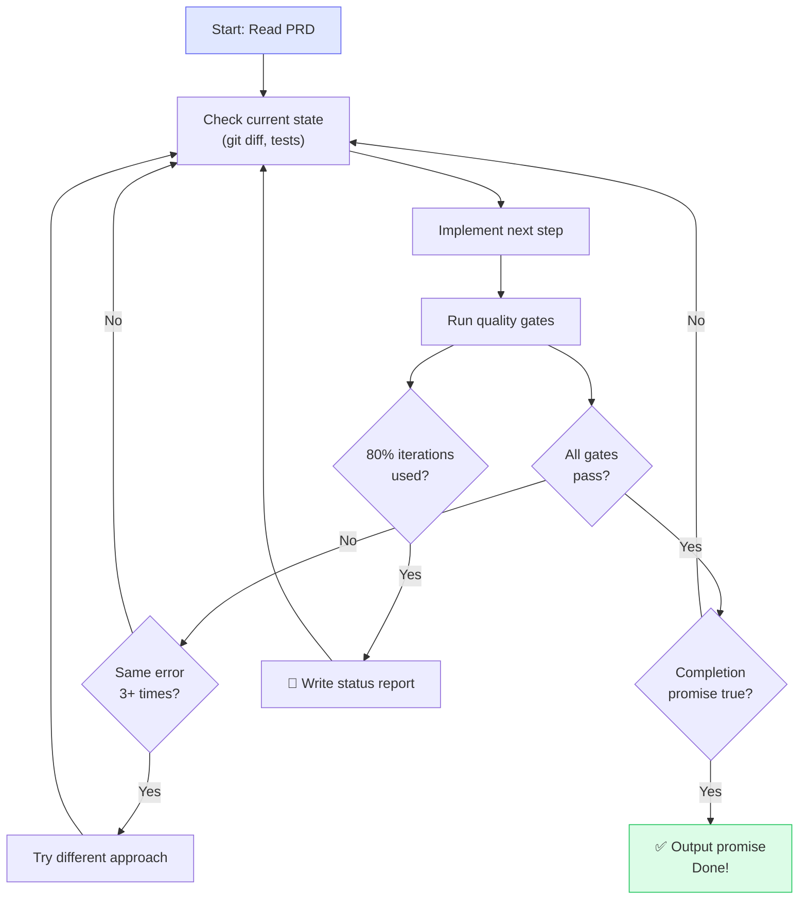
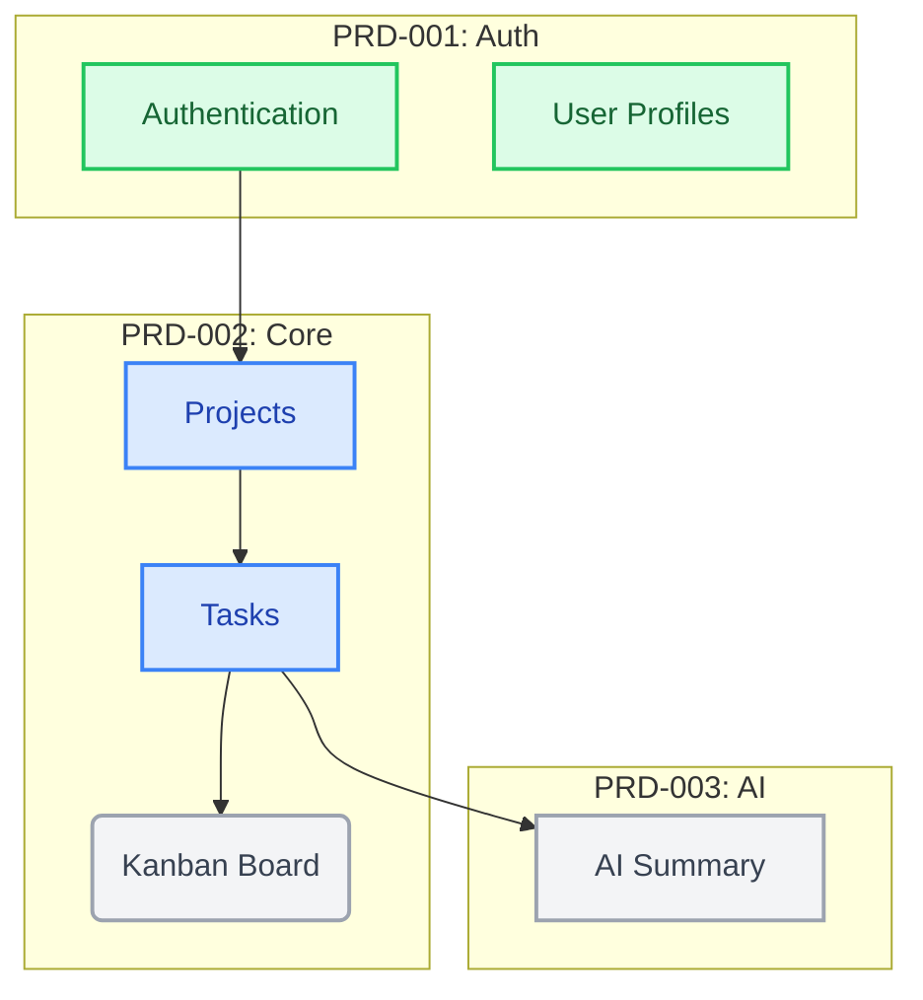
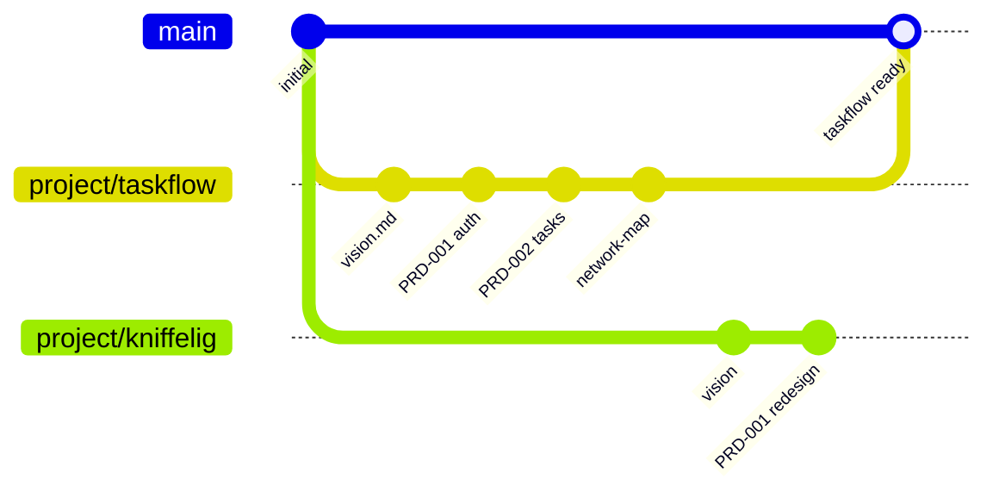

<div align="center">

# ⚡ Effectum

### Describe what you want. Get production-ready code.

_Effectum (Latin): the result, the accomplishment — that which has been brought to completion._

[](LICENSE)
[](https://claude.ai/claude-code)
[](CONTRIBUTING.md)

<br>

**An autonomous development system for Claude Code.**
Turn your ideas into structured specifications, then let Claude Code implement them — with tests, security checks, and quality gates — while you sleep.

<br>

[Quick Start](#-quick-start) · [How It Works](#-how-it-works) · [The Workflow](#-the-workflow) · [PRD Workshop](#-the-prd-workshop) · [Documentation](#-documentation)

</div>

---

## 🎯 How It Works

Effectum has two parts that work together:

<table>
<tr>
<td width="50%" valign="top">

### 🏗️ The Installer

Sets up your project with everything Claude Code needs for autonomous development:

- 10 workflow commands
- Quality gates & safety hooks
- Architecture rules & guardrails
- Stack-specific configuration

**One command: `/setup ~/my-project`**

</td>
<td width="50%" valign="top">

### 📋 The PRD Workshop

Helps you write specifications that are good enough for autonomous implementation:

- Guided discovery process
- Adaptive questioning
- Network maps & dependency graphs
- Quality scoring & review

**One command: `/prd:new`**

</td>
</tr>
</table>


---

## 🚀 Quick Start

```bash
# 1. Install Effectum
npx effectum
```

The interactive installer asks two questions — scope (global or local) and runtime — then sets everything up.

```bash
# 2. Open Claude Code in your project
cd ~/my-project && claude

# 3. Set up your project
/setup .

# 4. Write a specification
/prd:new

# 5. Build it
/plan docs/prds/001-my-feature.md
```

> [!TIP]
> That's it. Five steps from zero to autonomous development.

### Install options

```bash
npx effectum                   # Interactive (recommended)
npx effectum --global          # Install to ~/.claude/ for all projects
npx effectum --local           # Install to ./.claude/ for this project only
npx effectum --global --claude # Non-interactive, Claude Code runtime
```

<details>
<summary><strong>Prefer the classic git approach?</strong></summary>

```bash
git clone https://github.com/aslomon/effectum.git
cd effectum
claude
/setup ~/my-project
```

</details>

---

## 📦 What `/setup` Installs

One command. Four questions. 14 files. Your project is ready.

```
/setup ~/my-project
```

Claude asks: **project name** → **tech stack** → **language** → **autonomy level**

Then installs everything:

<details>
<summary><strong>📂 See all 14 installed files</strong></summary>

<br>

| File                                 | What it does                                                  |
| ------------------------------------ | ------------------------------------------------------------- |
| `CLAUDE.md`                          | Your project's brain — rules, architecture, quality standards |
| `AUTONOMOUS-WORKFLOW.md`             | Complete reference guide (1,300+ lines)                       |
| `.claude/commands/plan.md`           | `/plan` — Analyze, create implementation plan, wait for OK    |
| `.claude/commands/tdd.md`            | `/tdd` — Write tests first, then code                         |
| `.claude/commands/verify.md`         | `/verify` — Run all quality checks                            |
| `.claude/commands/e2e.md`            | `/e2e` — End-to-end browser tests                             |
| `.claude/commands/code-review.md`    | `/code-review` — Security + quality audit                     |
| `.claude/commands/build-fix.md`      | `/build-fix` — Fix errors one at a time                       |
| `.claude/commands/refactor-clean.md` | `/refactor-clean` — Remove dead code                          |
| `.claude/commands/ralph-loop.md`     | `/ralph-loop` — Fully autonomous overnight mode               |
| `.claude/commands/cancel-ralph.md`   | `/cancel-ralph` — Stop the loop                               |
| `.claude/commands/checkpoint.md`     | `/checkpoint` — Git restore point                             |
| `.claude/settings.json`              | Auto-formatting, file protection, safety hooks                |
| `.claude/guardrails.md`              | Rules that prevent known mistakes                             |

</details>

---

## 🔧 The Workflow

### `/plan` — Think before building

> Claude reads your specification, explores your codebase, and creates a plan. It identifies risks, asks questions, and **waits for your OK** before writing a single line of code.

### `/tdd` — Tests first, always

> Write a failing test → Write code to pass it → Improve → Repeat.
> Every feature is tested before it exists.

### `/verify` — Every quality gate, every time

| Gate           | What it checks              | Standard                |
| -------------- | --------------------------- | ----------------------- |
| 🔨 Build       | Compiles without errors     | 0 errors                |
| 📐 Types       | Type safety                 | 0 errors                |
| 🧹 Lint        | Clean code style            | 0 warnings              |
| 🧪 Tests       | Test suite                  | All pass, 80%+ coverage |
| 🔒 Security    | OWASP vulnerabilities       | None found              |
| 🚫 Debug logs  | `console.log` in production | 0 occurrences           |
| 🛡️ Type safety | `any` or unsafe casts       | None                    |
| 📏 File size   | Oversized files             | Max 300 lines           |

### `/code-review` — A second pair of eyes

> Reviews every change for security issues, code quality, architecture violations, and common mistakes. Rates findings as **Critical**, **Warning**, or **Info**.

### `/ralph-loop` — Build while you sleep

> [!IMPORTANT]
> This is the most powerful feature.

```bash
/ralph-loop "Build the auth system"
  --max-iterations 30
  --completion-promise "All tests pass, build succeeds, 0 lint errors"
```

Claude works autonomously — writing code, running tests, fixing errors, iterating — until **every quality gate passes**. It only stops when the promise is 100% true.

**You go to sleep. You wake up to a working feature.**

<details>
<summary><strong>🔄 How Ralph Loop works internally</strong></summary>

<br>



- **Built-in error recovery**: reads errors, tries alternatives, documents blockers
- **Status report at 80%**: if running out of iterations, writes what's done and what's left
- **Honest promises**: the completion promise is ONLY output when 100% true

</details>

---

## 📋 The PRD Workshop

A specification (PRD) is the bridge between _"I want this"_ and _"Claude builds this."_

The better the spec, the better the code.

### Two Modes

| Mode            | When to use                 | What happens                                                       |
| --------------- | --------------------------- | ------------------------------------------------------------------ |
| **🔍 Workshop** | Vague idea, complex project | Effectum asks questions round by round until it fully understands  |
| **⚡ Express**  | Clear requirements          | Describe it, Effectum fills gaps and produces the spec in one shot |

### What a Specification Contains

```
┌─────────────────────────────────────────┐
│  📋 EFFECTUM SPECIFICATION (PRD)        │
├─────────────────────────────────────────┤
│                                         │
│  Problem & Goal                         │
│  ── What are we solving? Why?           │
│                                         │
│  User Stories                           │
│  ── What can users do when done?        │
│                                         │
│  Acceptance Criteria                    │
│  ── Given X, When Y, Then Z            │
│  ── (every criterion = one test)        │
│                                         │
│  Data Model                            │
│  ── Tables, fields, types, RLS          │
│                                         │
│  API Design                            │
│  ── Endpoints, formats, error codes     │
│                                         │
│  Quality Gates                         │
│  ── 8 automated checks that must pass   │
│                                         │
│  Completion Promise                    │
│  ── "All tests pass, build succeeds,    │
│     0 lint errors"                      │
│                                         │
└─────────────────────────────────────────┘
```

### Network Map

For complex projects, Effectum generates a **visual network map** showing how every feature, module, and data entity connects:



<sup>🟢 Done 🔵 In Progress ⚪ Planned</sup>

### Workshop Commands

| Command             | What it does                              |
| ------------------- | ----------------------------------------- |
| `/prd:new`          | Start a new specification (guided)        |
| `/prd:express`      | Quick spec from clear input               |
| `/prd:discuss`      | Deep-dive into specific areas             |
| `/prd:review`       | Quality check — ready for implementation? |
| `/prd:decompose`    | Split a large project into pieces         |
| `/prd:network-map`  | Visualize connections (Mermaid)           |
| `/prd:handoff`      | Export spec to your project               |
| `/prd:status`       | See all projects and progress             |
| `/prd:resume`       | Continue where you left off               |
| `/prd:prompt`       | Generate the right handoff prompt         |
| `/workshop:init`    | Create a new project workspace            |
| `/workshop:archive` | Archive a completed project               |

---

## 🌳 Branching & Worktrees

Each PRD project in the workshop gets its own **git branch** — so you can work on multiple projects in parallel without interference.



### How It Works

**When you start a new project** (`/prd:new` or `/workshop:init`):

- A new branch `project/{slug}` is created
- All PRD work happens on this branch
- Your other projects remain untouched on their own branches

**When a project is done** (`/workshop:archive`):

- The branch is merged into `main`
- All specs are preserved in the history

**Working on multiple projects simultaneously** with worktrees:

```bash
# Main repo — working on TaskFlow
cd ~/effectum
# (on branch project/taskflow)

# Open a second project in a worktree
git worktree add ../effectum-kniffelig project/kniffelig

# Now you have two separate directories, each on its own branch:
# ~/effectum/              → project/taskflow
# ~/effectum-kniffelig/    → project/kniffelig
```

> [!TIP]
> **Worktrees** let you open Claude Code in each project simultaneously — two terminal windows, two branches, zero conflicts.

### Branch Overview

| Branch           | Purpose                                 | Lifetime       |
| ---------------- | --------------------------------------- | -------------- |
| `main`           | Stable state, knowledge base, templates | Permanent      |
| `project/{slug}` | Active PRD work for one project         | Until archived |

---

## 🎨 Stack Presets

Effectum adapts to your technology:

<table>
<tr>
<td width="25%" align="center">
<br>
<strong>Next.js + Supabase</strong>
<br><br>
TypeScript, Tailwind, Shadcn<br>
Supabase, Vitest, Playwright<br>
<br>
<em>Full-stack web apps</em>
<br><br>
</td>
<td width="25%" align="center">
<br>
<strong>Python + FastAPI</strong>
<br><br>
Pydantic, SQLAlchemy<br>
pytest, ruff<br>
<br>
<em>APIs and backends</em>
<br><br>
</td>
<td width="25%" align="center">
<br>
<strong>Swift / SwiftUI</strong>
<br><br>
SwiftData, XCTest<br>
swift-format, SPM<br>
<br>
<em>iOS and macOS apps</em>
<br><br>
</td>
<td width="25%" align="center">
<br>
<strong>Generic</strong>
<br><br>
Stack-agnostic<br>
Customize everything<br>
<br>
<em>Anything else</em>
<br><br>
</td>
</tr>
</table>

Each preset configures build commands, test frameworks, linters, formatters, and architecture rules for your stack.

---

## 🎚️ Three Autonomy Levels

Choose how much Claude decides on its own:

|                           |  Conservative   |    Standard     |  Full Autonomy   |
| ------------------------- | :-------------: | :-------------: | :--------------: |
| **Claude asks before...** |  Most changes   | Ambiguous specs |  Almost nothing  |
| **Git operations**        |   Always asks   |  Asks for push  |    Autonomous    |
| **File changes**          |  Confirms each  |  Works freely   |   Works freely   |
| **Best for**              | Teams, learning |    Daily dev    | Overnight builds |
| **Ralph Loop**            |       ❌        |       ✅        |  ✅ Recommended  |

Choose during `/setup`. Change anytime in `.claude/settings.json`.

---

## 🏗️ The Big Picture

```
┌──────────────────────────────────────────────────┐
│  EFFECTUM REPO                                   │
│  (clone once, use for all your projects)         │
│                                                  │
│  /setup ~/project-a    → Install workflow        │
│  /setup ~/project-b    → Install workflow        │
│  /setup ~/project-c    → Install workflow        │
│                                                  │
│  /prd:new              → Write specifications    │
│  /prd:handoff          → Send to project         │
└──────────┬───────────────────────────────────────┘
           │
           │  installs: CLAUDE.md, 10 commands,
           │  hooks, guardrails, quality gates
           │
     ┌─────┼─────────────┬──────────────┐
     ▼     ▼             ▼              ▼
┌─────────┐ ┌─────────┐ ┌─────────┐
│Project A│ │Project B│ │Project C│
│         │ │         │ │         │
│ /plan   │ │ /plan   │ │ /plan   │
│ /tdd    │ │ /tdd    │ │ /tdd    │
│ /verify │ │ /verify │ │ /verify │
│ /ralph  │ │ /ralph  │ │ /ralph  │
│ -loop   │ │ -loop   │ │ -loop   │
│         │ │         │ │         │
│ ✅ Code │ │ ✅ Code │ │ ✅ Code │
└─────────┘ └─────────┘ └─────────┘
```

---

## 📊 Before & After

|                | Without Effectum                   | With Effectum                                      |
| -------------- | ---------------------------------- | -------------------------------------------------- |
| 💡 Starting    | _"Build a login"_ → Claude guesses | Detailed spec → Claude knows exactly what to build |
| 🧪 Testing     | Maybe write tests after            | Tests written **first**, always                    |
| ✅ Quality     | Hope for the best                  | **8 automated gates** must pass                    |
| 🔒 Security    | Manual review (or forget)          | Automatic **OWASP audit**                          |
| 🌙 Overnight   | Not possible                       | Ralph Loop **builds while you sleep**              |
| 🔄 Consistency | Depends on the prompt              | **Same workflow, same quality**, every time        |

---

## 📁 Project Structure

```
effectum/
│
├── system/                          The installable workflow
│   ├── templates/                   CLAUDE.md, settings, guardrails (parameterized)
│   ├── commands/                    10 workflow commands
│   └── stacks/                     Next.js · Python · Swift · Generic
│
├── workshop/                        Specification tools
│   ├── knowledge/                   8 reference guides
│   ├── templates/                   PRD & project templates
│   └── projects/                    Your spec projects (per branch)
│
├── docs/                            Documentation
│   ├── workflow-overview.md         The complete workflow
│   ├── installation-guide.md        Setup step by step
│   ├── prd-workshop-guide.md        Writing great specs
│   ├── customization.md            Adapting Effectum
│   └── troubleshooting.md          Common fixes
│
├── CLAUDE.md                        Makes Claude understand this repo
└── README.md                        You are here
```

---

## 📚 Documentation

| Guide                                               | What you'll learn                          |
| --------------------------------------------------- | ------------------------------------------ |
| 📖 [Workflow Overview](docs/workflow-overview.md)   | The complete autonomous workflow explained |
| 🔧 [Installation Guide](docs/installation-guide.md) | Detailed setup instructions                |
| 📋 [PRD Workshop Guide](docs/prd-workshop-guide.md) | How to write great specifications          |
| ⚙️ [Customization](docs/customization.md)           | Adapting Effectum to your needs            |
| 🔍 [Troubleshooting](docs/troubleshooting.md)       | Common issues and solutions                |

---

## ❓ FAQ

<details>
<summary><strong>Do I need to write a specification for every feature?</strong></summary>

No. Use `/plan` directly with a description for small things. Specifications shine for anything complex — they eliminate back-and-forth and produce dramatically better results.

</details>

<details>
<summary><strong>Does this work with other AI coding tools?</strong></summary>

Effectum is built for Claude Code. The specifications it produces are useful for any AI tool, but the workflow commands (`/plan`, `/tdd`, etc.) are Claude Code specific.

</details>

<details>
<summary><strong>Can I customize everything after setup?</strong></summary>

Yes. Everything is plain text — edit `CLAUDE.md` for rules, `.claude/settings.json` for hooks, `.claude/guardrails.md` for safety rules. See [Customization](docs/customization.md).

</details>

<details>
<summary><strong>What if Ralph Loop gets stuck?</strong></summary>

Built-in error recovery: reads errors, tries alternatives, documents blockers. At 80% of max iterations, writes a status report of what's done and what's left. Use `/cancel-ralph` to stop it manually anytime.

</details>

<details>
<summary><strong>Is this safe to use?</strong></summary>

Yes. File protection blocks writes to `.env` and secrets. Destructive command prevention blocks `rm -rf` and `DROP TABLE`. Quality gates catch issues before they ship. Conservative mode asks before most actions.

</details>

<details>
<summary><strong>Can I work on multiple PRD projects simultaneously?</strong></summary>

Yes. Each project gets its own git branch. Use `git worktree` to open multiple projects in separate directories — each with its own Claude Code session. See [Branching & Worktrees](#-branching--worktrees).

</details>

---

## 🤝 Contributing

The most impactful areas:

- **🎨 Stack presets** — Add Go, Rust, Ruby, Django, etc.
- **🔧 Workflow commands** — Improve or add new ones
- **📚 Knowledge base** — Better examples, more techniques
- **🌍 Documentation** — Clearer guides, translations

---

<div align="center">

## License

MIT

<br>

_Effectum — that which has been brought to completion._

<br>

**[⬆ Back to top](#-effectum)**

</div>
