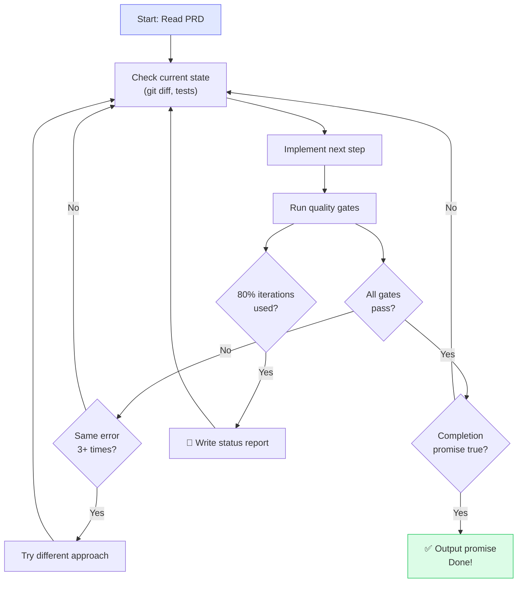

<div align="center">

<picture>
  <source media="(prefers-color-scheme: dark)" srcset="docs/logo-dark.svg">
  <source media="(prefers-color-scheme: light)" srcset="docs/logo-light.svg">
  
</picture>

<br><br>

### Describe what you want. Get production-ready code.

_Effectum (Latin): the result, the accomplishment — that which has been brought to completion._

[](https://www.npmjs.com/package/@aslomon/effectum)
[](LICENSE)
[](https://claude.ai/claude-code)
[](CONTRIBUTING.md)
[](https://aslomon.github.io/effectum/)

<br>

[Quick Start](#-quick-start) · [How It Works](#-how-it-works) · [The Workflow](#-the-workflow) · [PRD Workshop](#-the-prd-workshop) · [How is this different?](#-how-is-this-different) · [Website](https://aslomon.github.io/effectum/)

</div>

---

> Built by Jason Salomon-Rinnert. Works for me — might work for you. MIT licensed, PRs welcome.

## Why I built this

I'm a solo developer who builds everything with Claude Code. I tried BMAD, SpecKit, Taskmaster, GSD — they all taught me something. BMAD was too enterprise. SpecKit too rigid. GSD is brilliant at context engineering but doesn't help you write the spec in the first place.

So I built Effectum. It combines what I learned from all of them: structured specifications (like SpecKit), autonomous execution (like GSD's approach), and quality gates that actually enforce standards.

The result: describe what you want, write a proper spec with the PRD Workshop, then let Claude Code build it overnight with the Ralph Loop.

This isn't a new idea — it's the best combination of existing ideas I've found, packaged so it actually works.

---

## 🚀 Quick Start

```bash
npx @aslomon/effectum
```

The interactive installer asks two questions — scope (global or local) and runtime — then sets everything up.

```bash
# Open Claude Code in your project
cd ~/my-project && claude

# Set up your project (substitutes placeholders in settings.json)
/setup .

# Write a specification
/prd:new

# Build it
/plan docs/prds/001-my-feature.md
```

> [!TIP]
> That's it. Four steps from zero to autonomous development.

### Install options

```bash
npx @aslomon/effectum                   # Interactive (recommended)
npx @aslomon/effectum --global          # Install to ~/.claude/ for all projects
npx @aslomon/effectum --local           # Install to ./.claude/ for this project only
npx @aslomon/effectum --global --claude # Non-interactive, Claude Code runtime
```

<details>
<summary><strong>Prefer the classic git approach?</strong></summary>

```bash
git clone https://github.com/aslomon/effectum.git
cd effectum
claude
/setup ~/my-project
```

</details>

---

## 📦 What's Included

One command. Everything you need for autonomous Claude Code development.

| What                     | Details                                                                                                                            |
| ------------------------ | ---------------------------------------------------------------------------------------------------------------------------------- |
| **10 workflow commands** | `/plan`, `/tdd`, `/verify`, `/e2e`, `/code-review`, `/build-fix`, `/refactor-clean`, `/ralph-loop`, `/cancel-ralph`, `/checkpoint` |
| **PRD Workshop**         | 8 knowledge files for guided specification writing                                                                                 |
| **4 MCP servers**        | Context7, Playwright, Sequential Thinking, Filesystem                                                                              |
| **Playwright setup**     | Browser install + `playwright.config.ts`                                                                                           |
| **Stack presets**        | Next.js + Supabase, Python + FastAPI, Swift/SwiftUI, Generic                                                                       |
| **Quality gates**        | 8 automated checks (build, types, lint, tests, security, etc.)                                                                     |
| **Guardrails**           | Rules that prevent known mistakes                                                                                                  |

---

## 🎯 How It Works

Effectum has two parts that work together:

<table>
<tr>
<td width="50%" valign="top">

### 🏗️ The Installer

Sets up your project with everything Claude Code needs for autonomous development:

- 10 workflow commands
- Quality gates & safety hooks
- Architecture rules & guardrails
- Stack-specific configuration

**One command: `/setup ~/my-project`**

</td>
<td width="50%" valign="top">

### 📋 The PRD Workshop

Helps you write specifications that are good enough for autonomous implementation:

- Guided discovery process
- Adaptive questioning
- Network maps & dependency graphs
- Quality scoring & review

**One command: `/prd:new`**

</td>
</tr>
</table>


---

## 🔧 The Workflow

### `/plan` — Think before building

> Claude reads your specification, explores your codebase, and creates a plan. It identifies risks, asks questions, and **waits for your OK** before writing a single line of code.

### `/tdd` — Tests first, always

> Write a failing test → Write code to pass it → Improve → Repeat.
> Every feature is tested before it exists.

### `/verify` — Every quality gate, every time

| Gate           | What it checks              | Standard                |
| -------------- | --------------------------- | ----------------------- |
| 🔨 Build       | Compiles without errors     | 0 errors                |
| 📐 Types       | Type safety                 | 0 errors                |
| 🧹 Lint        | Clean code style            | 0 warnings              |
| 🧪 Tests       | Test suite                  | All pass, 80%+ coverage |
| 🔒 Security    | OWASP vulnerabilities       | None found              |
| 🚫 Debug logs  | `console.log` in production | 0 occurrences           |
| 🛡️ Type safety | `any` or unsafe casts       | None                    |
| 📏 File size   | Oversized files             | Max 300 lines           |

### `/code-review` — A second pair of eyes

> Reviews every change for security issues, code quality, architecture violations, and common mistakes. Rates findings as **Critical**, **Warning**, or **Info**.

### `/ralph-loop` — Build while you sleep

> [!IMPORTANT]
> This is the most powerful feature.

```bash
/ralph-loop "Build the auth system"
  --max-iterations 30
  --completion-promise "All tests pass, build succeeds, 0 lint errors"
```

Claude works autonomously — writing code, running tests, fixing errors, iterating — until **every quality gate passes**. It only stops when the promise is 100% true.

**You go to sleep. You wake up to a working feature.**

<details>
<summary><strong>🔄 How Ralph Loop works internally</strong></summary>

<br>



- **Built-in error recovery**: reads errors, tries alternatives, documents blockers
- **Status report at 80%**: if running out of iterations, writes what's done and what's left
- **Honest promises**: the completion promise is ONLY output when 100% true

</details>

---

## 📋 The PRD Workshop

A specification (PRD) is the bridge between _"I want this"_ and _"Claude builds this."_

The better the spec, the better the code.

### Two Modes

| Mode            | When to use                 | What happens                                                       |
| --------------- | --------------------------- | ------------------------------------------------------------------ |
| **🔍 Workshop** | Vague idea, complex project | Effectum asks questions round by round until it fully understands  |
| **⚡ Express**  | Clear requirements          | Describe it, Effectum fills gaps and produces the spec in one shot |

### What a Specification Contains

```
┌─────────────────────────────────────────┐
│  📋 EFFECTUM SPECIFICATION (PRD)        │
├─────────────────────────────────────────┤
│                                         │
│  Problem & Goal                         │
│  ── What are we solving? Why?           │
│                                         │
│  User Stories                           │
│  ── What can users do when done?        │
│                                         │
│  Acceptance Criteria                    │
│  ── Given X, When Y, Then Z            │
│  ── (every criterion = one test)        │
│                                         │
│  Data Model                            │
│  ── Tables, fields, types, RLS          │
│                                         │
│  API Design                            │
│  ── Endpoints, formats, error codes     │
│                                         │
│  Quality Gates                         │
│  ── 8 automated checks that must pass   │
│                                         │
│  Completion Promise                    │
│  ── "All tests pass, build succeeds,    │
│     0 lint errors"                      │
│                                         │
└─────────────────────────────────────────┘
```

### Workshop Commands

| Command             | What it does                              |
| ------------------- | ----------------------------------------- |
| `/prd:new`          | Start a new specification (guided)        |
| `/prd:express`      | Quick spec from clear input               |
| `/prd:discuss`      | Deep-dive into specific areas             |
| `/prd:review`       | Quality check — ready for implementation? |
| `/prd:decompose`    | Split a large project into pieces         |
| `/prd:network-map`  | Visualize connections (Mermaid)           |
| `/prd:handoff`      | Export spec to your project               |
| `/prd:status`       | See all projects and progress             |
| `/prd:resume`       | Continue where you left off               |
| `/prd:prompt`       | Generate the right handoff prompt         |
| `/workshop:init`    | Create a new project workspace            |
| `/workshop:archive` | Archive a completed project               |

---

## 🆚 How is this different?

| Tool           | What it does                              | What Effectum adds                                                         |
| -------------- | ----------------------------------------- | -------------------------------------------------------------------------- |
| **GSD**        | Context engineering, prevents context rot | PRD Workshop (helps you write the spec), Ralph Loop (autonomous overnight) |
| **BMAD**       | Full enterprise methodology               | Same ideas, 90% less ceremony                                              |
| **SpecKit**    | Living specifications                     | + Autonomous execution + Quality gates                                     |
| **Taskmaster** | Task breakdown from PRDs                  | + TDD workflow + Code review + E2E testing                                 |

The short version: Effectum doesn't invent new concepts. It combines what already works, removes what doesn't, and packages it so it actually runs.

---

## 🎨 Stack Presets

Effectum adapts to your technology:

<table>
<tr>
<td width="25%" align="center">
<br>
<strong>Next.js + Supabase</strong>
<br><br>
TypeScript, Tailwind, Shadcn<br>
Supabase, Vitest, Playwright<br>
<br>
<em>Full-stack web apps</em>
<br><br>
</td>
<td width="25%" align="center">
<br>
<strong>Python + FastAPI</strong>
<br><br>
Pydantic, SQLAlchemy<br>
pytest, ruff<br>
<br>
<em>APIs and backends</em>
<br><br>
</td>
<td width="25%" align="center">
<br>
<strong>Swift / SwiftUI</strong>
<br><br>
SwiftData, XCTest<br>
swift-format, SPM<br>
<br>
<em>iOS and macOS apps</em>
<br><br>
</td>
<td width="25%" align="center">
<br>
<strong>Generic</strong>
<br><br>
Stack-agnostic<br>
Customize everything<br>
<br>
<em>Anything else</em>
<br><br>
</td>
</tr>
</table>

Each preset configures build commands, test frameworks, linters, formatters, and architecture rules for your stack.

**Community presets coming**: Go+Echo, Rust+Actix, Django/FastAPI. [Open a PR.](CONTRIBUTING.md)

---

## 🎚️ Three Autonomy Levels

Choose how much Claude decides on its own:

|                           |  Conservative   |    Standard     |  Full Autonomy   |
| ------------------------- | :-------------: | :-------------: | :--------------: |
| **Claude asks before...** |  Most changes   | Ambiguous specs |  Almost nothing  |
| **Git operations**        |   Always asks   |  Asks for push  |    Autonomous    |
| **File changes**          |  Confirms each  |  Works freely   |   Works freely   |
| **Best for**              | Teams, learning |    Daily dev    | Overnight builds |
| **Ralph Loop**            |       ❌        |       ✅        |  ✅ Recommended  |

Choose during `/setup`. Change anytime in `.claude/settings.json`.

---

## ⚠️ Limitations

Effectum is useful, but it's honest about what it can't do yet:

- **Only works with Claude Code** — workflow commands are Claude Code specific. Other runtimes (Codex, Gemini CLI) are on the roadmap.
- **PRD Workshop requires Claude Code slash commands** — you can't use it from the web interface or API directly.
- **Ralph Loop effectiveness depends on PRD quality** — garbage in, garbage out. A vague spec produces vague code, even autonomously.
- **MCP servers need npm/Node.js** — if you're in a restricted environment without npm access, MCP setup will fail.

---

## 📁 Project Structure

```
effectum/
│
├── system/                          The installable workflow
│   ├── templates/                   CLAUDE.md, settings, guardrails (parameterized)
│   ├── commands/                    10 workflow commands
│   └── stacks/                     Next.js · Python · Swift · Generic
│
├── workshop/                        Specification tools
│   ├── knowledge/                   8 reference guides
│   ├── templates/                   PRD & project templates
│   └── projects/                    Your spec projects (per branch)
│
├── docs/                            Documentation
│   ├── workflow-overview.md         The complete workflow
│   ├── installation-guide.md        Setup step by step
│   ├── prd-workshop-guide.md        Writing great specs
│   ├── customization.md            Adapting Effectum
│   └── troubleshooting.md          Common fixes
│
├── CLAUDE.md                        Makes Claude understand this repo
└── README.md                        You are here
```

---

## 📚 Documentation

| Guide                                               | What you'll learn                          |
| --------------------------------------------------- | ------------------------------------------ |
| 📖 [Workflow Overview](docs/workflow-overview.md)   | The complete autonomous workflow explained |
| 🔧 [Installation Guide](docs/installation-guide.md) | Detailed setup instructions                |
| 📋 [PRD Workshop Guide](docs/prd-workshop-guide.md) | How to write great specifications          |
| ⚙️ [Customization](docs/customization.md)           | Adapting Effectum to your needs            |
| 🔍 [Troubleshooting](docs/troubleshooting.md)       | Common issues and solutions                |

---

## ❓ FAQ

<details>
<summary><strong>Do I need to write a specification for every feature?</strong></summary>

No. Use `/plan` directly with a description for small things. Specifications shine for anything complex — they eliminate back-and-forth and produce dramatically better results.

</details>

<details>
<summary><strong>Does this work with other AI coding tools?</strong></summary>

Effectum is built for Claude Code. The specifications it produces are useful for any AI tool, but the workflow commands (`/plan`, `/tdd`, etc.) are Claude Code specific. See [Limitations](#️-limitations).

</details>

<details>
<summary><strong>Can I customize everything after setup?</strong></summary>

Yes. Everything is plain text — edit `CLAUDE.md` for rules, `.claude/settings.json` for hooks, `.claude/guardrails.md` for safety rules. See [Customization](docs/customization.md).

</details>

<details>
<summary><strong>What if Ralph Loop gets stuck?</strong></summary>

Built-in error recovery: reads errors, tries alternatives, documents blockers. At 80% of max iterations, writes a status report of what's done and what's left. Use `/cancel-ralph` to stop it manually anytime.

</details>

<details>
<summary><strong>Is this safe to use?</strong></summary>

Yes. File protection blocks writes to `.env` and secrets. Destructive command prevention blocks `rm -rf` and `DROP TABLE`. Quality gates catch issues before they ship. Conservative mode asks before most actions.

</details>

<details>
<summary><strong>What does /setup actually do?</strong></summary>

`/setup` configures your project by substituting placeholders in `settings.json` and `CLAUDE.md` with your actual project name, tech stack, language, and autonomy level. Run it once per project after installing Effectum.

</details>

---

## 🤝 Contributing

The most impactful areas:

- **🎨 Stack presets** — Add Go, Rust, Ruby, Django, etc.
- **🔧 Workflow commands** — Improve or add new ones
- **📚 Knowledge base** — Better examples, more techniques
- **🌍 Documentation** — Clearer guides, translations

---

<div align="center">

## License

MIT © 2026 [Jason Salomon-Rinnert](https://github.com/aslomon)

<br>

_Effectum — that which has been brought to completion._

<br>

**[⬆ Back to top](#-effectum)**

</div>
