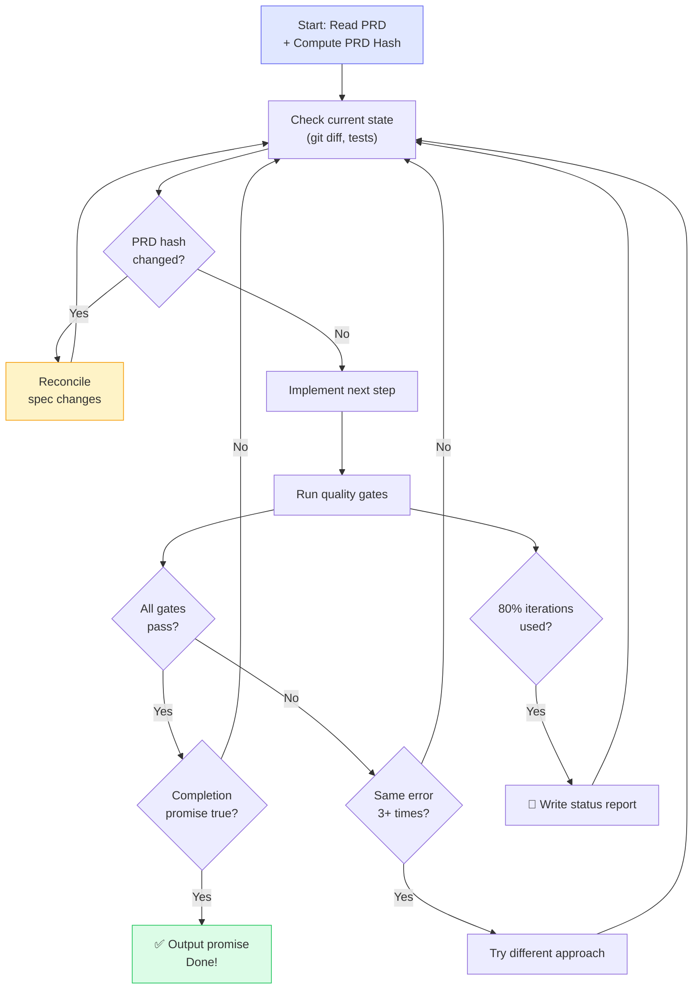

<div align="center">

<picture>
  <source media="(prefers-color-scheme: dark)" srcset="docs/logo-dark.svg">
  <source media="(prefers-color-scheme: light)" srcset="docs/logo-light.svg">
  
</picture>

<br><br>

### Describe what you want. Get production-ready code.

_Effectum (Latin): the result, the accomplishment — that which has been brought to completion._

[](https://www.npmjs.com/package/@aslomon/effectum)
[](LICENSE)
[](https://claude.ai/claude-code)
[](CONTRIBUTING.md)
[](CHANGELOG.md)
[](https://aslomon.github.io/effectum/)

<br>

[Quick Start](#-quick-start) · [Command Spheres](#-command-spheres) · [The Workflow](#-the-workflow) · [Design](#-design-system-generation) · [Update Command](#-update-command) · [PRD Lifecycle](#-prd-lifecycle) · [Project Onboarding](#-project-onboarding) · [Foundation](#-foundation) · [How is this different?](#-how-is-this-different) · [Website](https://aslomon.github.io/effectum/)

</div>

---

> Built by Jason Salomon-Rinnert. Works for me — might work for you. MIT licensed, PRs welcome.

## Why I built this

I'm a solo developer who builds everything with Claude Code. I tried BMAD, SpecKit, Taskmaster, GSD — they all taught me something. BMAD was too enterprise. SpecKit too rigid. GSD is brilliant at context engineering but doesn't help you write the spec in the first place.

So I built Effectum. It combines what I learned from all of them: structured specifications (like SpecKit), autonomous execution (like GSD's approach), and quality gates that actually enforce standards.

**v0.16.0 is the trust + brownfield release.** The autonomous loop now knows when it's stuck (2 repeated errors → stop + diagnosis), when it's running out of context (80% budget → clean handoff), and it persists state to disk so crashed sessions can resume. That release introduced what is now `effect:dev:diagnose` for post-mortem analysis, `effectum:init` for domain context, and `effectum:explore` for parallel brownfield mapping. Plus sentinel-based CLAUDE.md splitting so your project context survives updates.

**v0.17.0 is the Apple-like clarity release.** New users got `/effectum` as a starting point and what is now `effect:next` as a smart router that reads project state and tells you exactly what to do. Human-language aliases for run, stop, save, diagnose, and explore made the daily vocabulary more intuitive. It also cleaned up earlier namespace transitions and fixed 12 journey bugs found by 6 parallel code analysis agents.

**v0.18 is Namespace Clarity.** Effectum now separates commands into two clear spheres: `effectum:*` for system, setup, and meta work; `effect:*` for the actual software pipeline. `effectum:status` gives you a project-health dashboard, `effect:prd:*` owns the PRD lifecycle, and `effect:dev:*` owns implementation. `/effectum` stays the front door. `/ralph-loop` stays forever as the brand alias for `effect:dev:run`.

The result: from zero to autonomous development, for any stack, any language, with the self-awareness and crash recovery that make overnight builds actually trustworthy.

This isn't a new idea — it's the best combination of existing ideas I've found, packaged so it actually works.

---

## 🚀 Quick Start

```bash
npx @aslomon/effectum
```

The interactive configurator detects your stack, asks what you're building, and sets everything up.

```bash
# Open Claude Code in your project
cd ~/my-project && claude

# Check project health and installation
effectum:status

# Onboard an existing codebase
effectum:onboard

# Or write a specification and build from scratch
effect:prd:new
effect:dev:plan docs/prds/001-my-feature.md
```

> [!TIP]
> New project? `effect:prd:new` → `effect:dev:plan` → `effect:dev:run` (or `/ralph-loop`). Existing codebase? Start with `effectum:onboard` — it gives Claude a complete picture of what you already have.

> [!NOTE]
> **Upgrading from v0.17?** All old names work as deprecated aliases until **v0.20**.

### Install options

```bash
npx @aslomon/effectum                   # Interactive configurator (recommended)
npx @aslomon/effectum --global          # Install to ~/.claude/ for all projects
npx @aslomon/effectum --local           # Install to ./.claude/ for this project only
npx @aslomon/effectum --global --claude # Non-interactive, Claude Code runtime
```

<details>
<summary><strong>Prefer the classic git approach?</strong></summary>

```bash
git clone https://github.com/aslomon/effectum.git
cd effectum
claude
/effectum:setup ~/my-project
```

</details>

---

## 📦 What's Included

One command. Everything you need for autonomous Claude Code development.

| What                          | Details                                                                                                                                                                                                                                                                                                                                                                                                                                                                                                                                                                                                                                                               |
| ----------------------------- | --------------------------------------------------------------------------------------------------------------------------------------------------------------------------------------------------------------------------------------------------------------------------------------------------------------------------------------------------------------------------------------------------------------------------------------------------------------------------------------------------------------------------------------------------------------------------------------------------------------------------------------------------------------------- |
| **Intelligent Configurator**  | Stack auto-detection, package manager config, 8 quick presets, 16 languages                                                                                                                                                                                                                                                                                                                                                                                                                                                                                                                                                                                           |
| **32 primary commands**       | `/effectum`, `effectum:setup`, `effectum:init`, `effectum:status`, `effectum:archive`, `effectum:onboard`, `effectum:onboard:review`, `effectum:explore`, `effect:next`, `effect:design`, `effect:prd:new`, `effect:prd:express`, `effect:prd:review`, `effect:prd:handoff`, `effect:prd:update`, `effect:prd:discuss`, `effect:prd:decompose`, `effect:prd:resume`, `effect:prd:status`, `effect:prd:network-map`, `effect:dev:run`, `effect:dev:stop`, `effect:dev:save`, `effect:dev:diagnose`, `effect:dev:plan`, `effect:dev:tdd`, `effect:dev:verify`, `effect:dev:review`, `effect:dev:e2e`, `effect:dev:fix`, `effect:dev:refactor`, `effect:dev:orchestrate` |
| **Permanent aliases**         | `/ralph-loop` → `effect:dev:run`, `/help` → `/effectum`                                                                                                                                                                                                                                                                                                                                                                                                                                                                                                                                                                                                               |
| **Update Command**            | `npx @aslomon/effectum update` — add new commands, refresh templates, preserve config                                                                                                                                                                                                                                                                                                                                                                                                                                                                                                                                                                                 |
| **PRD Lifecycle**             | Frontmatter, changelog, semantic diff, delta handoffs, task registry, network map auto-sync                                                                                                                                                                                                                                                                                                                                                                                                                                                                                                                                                                           |
| **Project Onboarding**        | 6 parallel analysis agents, 7-point self-test loop, per-area PRDs, interactive HTML network map                                                                                                                                                                                                                                                                                                                                                                                                                                                                                                                                                                       |
| **Design System Generation**  | `effect:design` generates DESIGN.md — color tokens, typography, component specs, constraints                                                                                                                                                                                                                                                                                                                                                                                                                                                                                                                                                                          |
| **25 Agent Specializations**  | Pre-configured agent roles with distinct behaviors for planning, TDD, review, security, and more                                                                                                                                                                                                                                                                                                                                                                                                                                                                                                                                                                      |
| **43+ Skills**                | Reusable capability blocks attached to agent roles                                                                                                                                                                                                                                                                                                                                                                                                                                                                                                                                                                                                                    |
| **7 Stack Presets + 8 Quick** | Next.js+Supabase, Python+FastAPI, Swift/SwiftUI, Go+Echo, Django+PostgreSQL, Rust+Actix, Generic + Firebase, Prisma, Flutter…                                                                                                                                                                                                                                                                                                                                                                                                                                                                                                                                         |
| **YAML Frontmatter**          | All command files have machine-readable metadata (`name`, `description`, `allowed-tools`)                                                                                                                                                                                                                                                                                                                                                                                                                                                                                                                                                                             |
| **Quality gates**             | 8 automated checks (build, types, lint, tests, security, etc.)                                                                                                                                                                                                                                                                                                                                                                                                                                                                                                                                                                                                        |
| **Foundation Hooks**          | Always-on: secret detection, TDD enforcement, guardrails                                                                                                                                                                                                                                                                                                                                                                                                                                                                                                                                                                                                              |
| **Extensible**                | JSON-based tool definitions + detection rules, community presets + blocks                                                                                                                                                                                                                                                                                                                                                                                                                                                                                                                                                                                             |
| **446 tests**                 | Comprehensive test suite covering configurator, templates, commands, frontmatter, and more                                                                                                                                                                                                                                                                                                                                                                                                                                                                                                                                                                            |

---

## ✨ Command Spheres

Effectum now has a cleaner mental model.

### `effectum:*` — System Sphere

Use these before or around development. They set up the environment, understand the codebase, and tell you the current state.

| Command                   | What it does                                                        |
| ------------------------- | ------------------------------------------------------------------- |
| `effectum:setup`          | Install Effectum workflow into a project                            |
| `effectum:init`           | Teach Claude about your domain and project conventions              |
| `effectum:status`         | Project-health dashboard: version, stack, PRDs, loop status         |
| `effectum:archive`        | Archive a completed project                                         |
| `effectum:onboard`        | Full codebase analysis with 6 parallel agents + self-test loop      |
| `effectum:onboard:review` | Re-run onboarding review after significant changes                  |
| `effectum:explore`        | Fast brownfield analysis with 4 parallel agents and structured docs |

### `effect:*` — Pipeline Sphere

Use these while building. They move a feature from idea to spec to production-ready code.

| Area             | Commands                                                                                                                                                                                                                                          |
| ---------------- | ------------------------------------------------------------------------------------------------------------------------------------------------------------------------------------------------------------------------------------------------- |
| **Navigation**   | `effect:next`                                                                                                                                                                                                                                     |
| **PRD pipeline** | `effect:prd:new`, `effect:prd:express`, `effect:prd:review`, `effect:prd:handoff`, `effect:prd:update`, `effect:prd:discuss`, `effect:prd:decompose`, `effect:prd:resume`, `effect:prd:status`, `effect:prd:network-map`                          |
| **Dev pipeline** | `effect:dev:run`, `effect:dev:stop`, `effect:dev:save`, `effect:dev:diagnose`, `effect:dev:plan`, `effect:dev:tdd`, `effect:dev:verify`, `effect:dev:review`, `effect:dev:e2e`, `effect:dev:fix`, `effect:dev:refactor`, `effect:dev:orchestrate` |
| **Standalone**   | `effect:design`, `effect:next`                                                                                                                                                                                                                    |

> [!TIP]
> Old names still work until v0.20, but the documentation now uses the canonical v0.18 namespace everywhere.

---

## 🎯 How It Works

Effectum has three parts that work together:

<table>
<tr>
<td width="33%" valign="top">

### ⚙️ The Configurator

Sets up your project intelligently — detects your stack, recommends settings, and configures everything in four steps:

- App type + intent → recommended setup
- Ecosystem → Framework → DB → Deploy
- 8 quick presets for instant start
- 16 languages + custom

**One command: `npx @aslomon/effectum`**

</td>
<td width="33%" valign="top">

### 📋 The PRD Lifecycle

Write, evolve, and track specifications across the life of a project:

- Guided writing + semantic diffs
- Changelog + frontmatter
- Task registry (tasks.md)
- Network Map auto-sync
- PRD-hash detection in the autonomous loop

**One command: `effect:prd:new`**

</td>
<td width="33%" valign="top">

### 🔍 Project Onboarding

Drop into any unfamiliar codebase and understand it completely:

- 6 parallel analysis agents
- 7-point self-test loop
- PRDs per feature area
- Interactive HTML network map

**One command: `effectum:onboard`**

</td>
</tr>
</table>


---

## ⚙️ Configurator

The configurator is what makes Effectum genuinely approachable for any stack. You don't configure Effectum — Effectum figures out what you need and configures itself.

### Intelligent Setup Recommender

Tell it what type of app you're building and what you want to accomplish. It maps your input to a recommended stack and workflow configuration.

```
What are you building?
> A multi-tenant SaaS with Stripe billing and a REST API

Recommended setup:
  ✓ Stack: Next.js + Supabase
  ✓ Auth: Supabase RLS + JWT
  ✓ Payments: Stripe webhook pattern
  ✓ Testing: Vitest + Playwright
  ✓ Deploy: Vercel
```

### Smart Auto-Detection

Drop it into any project and it reads your existing config files to detect your stack automatically:

| File detected      | Stack recognized    |
| ------------------ | ------------------- |
| `package.json`     | Node.js / framework |
| `next.config.*`    | Next.js             |
| `pyproject.toml`   | Python ecosystem    |
| `go.mod`           | Go                  |
| `Package.swift`    | Swift / SPM         |
| `pubspec.yaml`     | Flutter / Dart      |
| `requirements.txt` | Python (legacy)     |
| `Cargo.toml`       | Rust                |

### Modular Stack Selection (4 Steps)

If auto-detection doesn't nail it, or you want to be explicit:

```
Step 1/4: Ecosystem    → Node.js / Python / Go / Swift / Dart / …
Step 2/4: Framework    → Next.js / FastAPI / Echo / SwiftUI / …
Step 3/4: Database     → Supabase / PostgreSQL / Firebase / SQLite / …
Step 4/4: Deploy       → Vercel / Railway / Fly.io / App Store / …
```

### 8 Quick Presets

One click. Instantly configured.

| Preset                  | Stack                            |
| ----------------------- | -------------------------------- |
| **Next.js + Supabase**  | Full-stack web, TypeScript       |
| **Python + FastAPI**    | API backend, Pydantic            |
| **Swift / SwiftUI**     | iOS / macOS native               |
| **Go + Echo**           | High-performance API             |
| **Django + PostgreSQL** | Python web, ORM-first            |
| **Generic**             | Stack-agnostic, customize freely |
| **+ Firebase**          | Any framework + Firebase backend |
| **+ Prisma**            | Any framework + Prisma ORM       |
| **+ Flutter**           | Cross-platform mobile            |

### Language & CLI Setup

- **16 languages supported** + custom
- CLI tool check on install: detects what's missing (`brew`, `pipx`, `go`, `swiftpm`, etc.)
- Guided installation walkthrough when tools are absent — no silent failures

---

## 🔧 The Workflow

The namespace is now simple: **System** with `effectum:*`, **Pipeline** with `effect:*`, and `/effectum` as the entry point.

### System Commands (`effectum:*`)

| Command                   | What it does                                                              |
| ------------------------- | ------------------------------------------------------------------------- |
| `effectum:setup`          | Install Effectum workflow into a project                                  |
| `effectum:init`           | Interactive interview to populate project context in `CLAUDE.md`          |
| `effectum:status`         | Project dashboard: installed version, stack, autonomy level, PRDs, health |
| `effectum:onboard`        | Full codebase analysis with 6 parallel agents + self-test loop            |
| `effectum:onboard:review` | Re-run onboarding review after significant changes                        |
| `effectum:explore`        | 4 parallel agents → 7 structured knowledge docs for brownfield codebases  |
| `effectum:archive`        | Archive a completed project                                               |

### Pipeline Commands (`effect:*`)

#### PRD Pipeline (`effect:prd:*`)

| Command                  | What it does                                                        |
| ------------------------ | ------------------------------------------------------------------- |
| `effect:prd:new`         | Start a new specification (guided workshop)                         |
| `effect:prd:express`     | Quick PRD from structured input                                     |
| `effect:prd:discuss`     | Deep-dive discussion for a specific PRD                             |
| `effect:prd:decompose`   | Split large scope into multiple PRDs                                |
| `effect:prd:update`      | Evolve an existing spec — tracks changes semantically               |
| `effect:prd:review`      | Quality check — is this spec ready for implementation?              |
| `effect:prd:handoff`     | Delta handoff export for implementation (`--prompt-only` supported) |
| `effect:prd:resume`      | Resume work on an existing project/PRD                              |
| `effect:prd:status`      | Dashboard of all projects and PRDs                                  |
| `effect:prd:network-map` | Render PRD dependencies as interactive HTML map                     |

#### Dev Pipeline (`effect:dev:*`)

| Command                  | What it does                                                             |
| ------------------------ | ------------------------------------------------------------------------ |
| `effect:dev:plan`        | Read spec, explore codebase, produce a plan — **waits for your OK**      |
| `effect:dev:tdd`         | Failing test → passing code → refactor → repeat                          |
| `effect:dev:verify`      | Run all 8 quality gates                                                  |
| `effect:dev:review`      | Security audit, architecture review, rating by severity                  |
| `effect:dev:e2e`         | End-to-end test run with Playwright                                      |
| `effect:dev:fix`         | Targeted fix loop for a specific failing build or test                   |
| `effect:dev:refactor`    | Clean up code without changing behavior                                  |
| `effect:dev:run`         | Autonomous build loop — writes, tests, fixes, iterates until done        |
| `effect:dev:stop`        | Stop the loop cleanly, preserve state                                    |
| `effect:dev:save`        | Snapshot current state (git + test results + notes)                      |
| `effect:dev:diagnose`    | Post-mortem diagnosis — reads loop artifacts and produces failure report |
| `effect:dev:orchestrate` | Parallel agent teams (opt-in)                                            |

#### Standalone Pipeline Commands

| Command         | What it does                                                     |
| --------------- | ---------------------------------------------------------------- |
| `effect:design` | Generate `DESIGN.md` — color tokens, typography, component specs |
| `effect:next`   | Read project state and recommend the single best next action     |

> [!TIP]
> See the full [Command Index](system/commands/README.md) for all commands organized by sphere and namespace.

---

### `effect:dev:run` — Build while you sleep

> [!IMPORTANT]
> This is the most powerful feature.

`effect:dev:run` is the canonical command. `/ralph-loop` remains a **permanent alias** and will never be removed.

```bash
effect:dev:run "Build the auth system"
  --max-iterations 30
  --completion-promise "All tests pass, build succeeds, 0 lint errors"
```

Claude works autonomously — writing code, running tests, fixing errors, iterating — until **every quality gate passes**. It only stops when the promise is 100% true.

**You go to sleep. You wake up to a working feature.**

The loop also detects PRD changes mid-run via PRD-hash comparison. If your spec was updated while the loop was running, it pauses and reconciles before continuing.

<details>
<summary><strong>🔄 How the loop works internally</strong></summary>

<br>



- **PRD-hash detection**: if your spec changes mid-run, the loop reconciles before continuing
- **Built-in error recovery**: reads errors, tries alternatives, documents blockers
- **Status report at 80%**: if running low on iterations, writes what's done and what's left
- **Honest promises**: the completion promise is ONLY output when 100% true

</details>

---

### `effect:dev:diagnose` — Post-mortem diagnosis

When the autonomous loop stops unexpectedly — due to stuck detection, a context budget stop, or an incomplete run — `effect:dev:diagnose` gives you a clear picture of what happened.

```bash
effect:dev:diagnose
```

It reads all available loop artifacts and produces a structured diagnosis report:

| Artifact                      | What it reveals                                           |
| ----------------------------- | --------------------------------------------------------- |
| `HANDOFF.md`                  | Context budget stop — what was done, what's left          |
| `STUCK.md`                    | Stuck detection report — the repeated error and diagnosis |
| `.effectum/loop-state.json`   | Last persisted iteration state                            |
| `effectum-metrics.json`       | Historical session ledger                                 |
| `.claude/ralph-loop.local.md` | Internal loop state                                       |
| `.claude/ralph-blockers.md`   | Documented blockers                                       |

The output is a root-cause diagnosis with a recommended next action — whether that's fixing the blocker, resuming from checkpoint, or rewriting a failing test.

---

### `effectum:init` — Project context bootstrap

Teach Claude about your domain before it writes a single line of code. `effectum:init` runs an interactive interview and writes the results into a sentinel block in `CLAUDE.md`:

```bash
effectum:init
```

It asks about your domain model, key business rules, naming conventions, and any constraints the code must respect. The result is persisted between Effectum updates — the sentinel block is preserved when `npx @aslomon/effectum update` refreshes the rest of CLAUDE.md.

```
<!-- effectum:project-context:start -->
  Domain: Multi-tenant SaaS for event management
  Key entities: Tenant, Event, Booking, Venue
  Auth: Row-level security — all queries must be tenant-scoped
  ...
<!-- effectum:project-context:end -->
```

This is the right command to run before `effect:dev:run` on a new project, or before onboarding a Claude Code session to an existing domain.

---

### `effectum:explore` — Parallel brownfield analysis

`effectum:explore` is purpose-built for understanding codebases you didn't write. It spawns **4 parallel analysis agents** and produces **7 structured knowledge documents** in `knowledge/codebase/`:

```bash
effectum:explore
```

| Agent                  | Output document                                    |
| ---------------------- | -------------------------------------------------- |
| **ArchitectureMapper** | `ARCHITECTURE.md` — structure, modules, boundaries |
| **DataFlowMapper**     | `DATA-FLOW.md` — how data moves through the system |
| **APIMapper**          | `API-SURFACE.md` — all endpoints, contracts, auth  |
| **DependencyMapper**   | `DEPENDENCIES.md` — packages, versions, risk flags |

Plus three synthesis documents: `ENTRY-POINTS.md`, `RISK-MAP.md`, and `KNOWLEDGE-INDEX.md`.

> [!TIP]
> Use `effectum:explore` for fast brownfield orientation. Use `effectum:onboard` when you want the full analysis including self-test loop and per-area PRDs.

---

### `effectum:status` — Project dashboard

Open a project and want instant orientation? `effectum:status` gives you a read-only dashboard of the current state.

```bash
effectum:status
```

It summarizes:

- installed Effectum version
- detected stack and autonomy level
- CLAUDE.md project context
- PRD inventory and status
- last loop run and health signals

If something is wrong — a recent `STUCK.md`, an incomplete handoff, missing installation — it tells you immediately and points to the next action.

---

### Autonomous Loop — Self-Awareness Features (v0.16.0)

Three mechanisms make the loop trustworthy enough for overnight builds:

#### Context Budget Monitor

The loop monitors its own context usage. At **80% of the context budget**, it automatically:

1. Writes a clean `HANDOFF.md` to the project root — what's done, what's left, iteration count
2. Commits current state to git
3. Stops cleanly

The next Claude Code session can pick up exactly where it left off. Use `effect:dev:diagnose` to analyze the handoff, then `effect:prd:resume` to continue.

#### Stuck Detection

If the loop encounters the **same error twice in a row**, it:

1. Writes `STUCK.md` with the error, the context that produced it, and a preliminary diagnosis
2. Stops the loop
3. Returns control to you

This prevents the loop from burning iterations on the same problem. Use `effect:dev:diagnose` to get a full diagnosis and recommended fix.

#### Per-Iteration Loop State

Every iteration, the loop persists its state to `.effectum/loop-state.json`:

```json
{
  "iteration": 14,
  "maxIterations": 30,
  "lastAction": "Fixed failing auth test",
  "qualityGateStatus": { "build": "pass", "tests": "fail", "lint": "pass" },
  "blockers": [],
  "prdHash": "a3f8d2c1"
}
```

This enables `effect:dev:diagnose` to reconstruct exactly what the loop was doing when it stopped — even if it crashed mid-iteration.

---

### Sentinel CLAUDE.md Split

Starting in v0.16.0, CLAUDE.md uses sentinel markers to separate system-managed content from your project context:

```
[System-managed Effectum configuration]
...

<!-- effectum:project-context:start -->
[Your project context — written by effectum:init]
<!-- effectum:project-context:end -->
```

When you run `npx @aslomon/effectum update`, the system-managed section is refreshed with the latest templates and rules. Your project context between the sentinel markers is **never touched**. You can also edit the sentinel block manually — Effectum will preserve your changes across updates.

---

### Hook Modernization

Foundation hooks now support richer configuration:

| Feature               | Example                                                                 |
| --------------------- | ----------------------------------------------------------------------- |
| **Conditional `if:`** | Run a hook only when specific files are staged                          |
| **Multi-glob**        | Match multiple file patterns in a single hook rule                      |
| **`effort:` level**   | Tag commands as `low`, `medium`, or `high` effort for context budgeting |

Hooks remain always-active for the three core guardrails (secret detection, TDD enforcement, destructive command blocking). The new features apply to custom hooks you add in `system/hooks/`.

> **Minimum version: Claude Code v2.1.88** — The `PermissionDenied` hook event, compound-command `if`-condition matching (`FOO=bar cmd`, `cmd1 && cmd2`), and the StructuredOutput schema-cache fix all require v2.1.88+. See [docs/hooks.md](docs/hooks.md#compatibility-notes) for details.

---

### `effect:dev:verify` — Every quality gate, every time

| Gate           | What it checks              | Standard                |
| -------------- | --------------------------- | ----------------------- |
| 🔨 Build       | Compiles without errors     | 0 errors                |
| 📐 Types       | Type safety                 | 0 errors                |
| 🧹 Lint        | Clean code style            | 0 warnings              |
| 🧪 Tests       | Test suite                  | All pass, 80%+ coverage |
| 🔒 Security    | OWASP vulnerabilities       | None found              |
| 🚫 Debug logs  | `console.log` in production | 0 occurrences           |
| 🛡️ Type safety | `any` or unsafe casts       | None                    |
| 📏 File size   | Oversized files             | Max 300 lines           |

---

## 🎨 Design System Generation

`effect:design` generates a structured `DESIGN.md` before you write a line of frontend code. It bridges the gap between "what to build" (PRD) and "how it should look" (implementation).

```
effect:prd:new → PRD approved → effect:design → DESIGN.md generated → effect:dev:plan → effect:dev:run
```

### How It Works

1. **Reads the active PRD** — extracts project name, app type, key features
2. **Scans for design signals** — detects Tailwind, shadcn/ui, CSS custom properties, UI libraries
3. **Asks 3–5 lightweight questions** — color palette, typography feel, UI complexity, references
4. **Generates DESIGN.md** — 7 sections: Overview, Color System, Typography, Component Patterns, Layout & Spacing, Interaction Design, Constraints
5. **Confirms** — summarizes key decisions, suggests `effect:dev:plan` as next step

> [!TIP]
> `DESIGN.md` is optional for CLI tools, API backends, and libraries. Only suggested for web apps, mobile apps, and fullstack projects.

---

## 🔄 Update Command

Already have Effectum installed? Update without re-running the full setup:

> **Upgrading from v0.16 or earlier?** See [MIGRATION.md](./MIGRATION.md) for the full command rename table (38 deprecated aliases, removed in v0.20).

```bash
npx @aslomon/effectum update
```

The update command:

- **Diffs commands** — shows new and updated commands available in the latest version
- **Re-renders templates** — refreshes CLAUDE.md, settings.json, and guardrails.md from your existing config
- **Preserves your config** — reads `.effectum.json`, keeps your stack, autonomy level, and customizations
- **Supports `--yes`** — non-interactive mode for CI and automation

```
$ npx @aslomon/effectum update
ℹ Project: "my-app" (nextjs-supabase)
ℹ Namespace migration already applied
ℹ 1 command update available:
    ~ effectum:status
✔ Updated: commands refreshed, CLAUDE.md preserved, aliases kept for compatibility
```

---

## 📦 Package Manager Configurator

The configurator now auto-detects your package manager from lock files and recommends the best option for your ecosystem.

| Lock file detected | Package manager    |
| ------------------ | ------------------ |
| `pnpm-lock.yaml`   | pnpm (recommended) |
| `yarn.lock`        | yarn               |
| `bun.lockb`        | bun                |
| `uv.lock`          | uv                 |
| `Cargo.lock`       | cargo              |
| `go.sum`           | go                 |

- **Apple-like flow**: detected package manager → confirm or change
- **Ecosystem-aware defaults**: pnpm for JS, uv for Python, cargo for Rust, go for Go
- **Flows through all templates** via `{{PACKAGE_MANAGER}}` — CLAUDE.md, guardrails, and settings all use the correct manager
- **Supports**: npm, pnpm, yarn, bun, uv, pip, poetry, cargo, go, swift package (SPM), flutter

---

## 📋 PRD Lifecycle

Specifications aren't static. They evolve. Effectum treats PRDs as living documents with full version control, semantic diffing, and automatic synchronization across your project.

### Frontmatter & Changelog

Every PRD now has structured frontmatter:

```yaml
---
id: prd-001
title: Auth System
status: in-progress
version: 1.3.0
created: 2026-01-15
updated: 2026-03-20
hash: a3f8d2c1
authors:
  - jason
implements:
  - prd-000-foundation
affects:
  - tasks.md
  - docs/network-map.html
---
```

And an auto-maintained changelog at the bottom:

```markdown
## Changelog

- v1.3.0 (2026-03-20): Added rate limiting spec, revised token refresh flow
- v1.2.0 (2026-03-10): Expanded RLS policy section
- v1.1.0 (2026-02-28): Added 2FA requirements
- v1.0.0 (2026-01-15): Initial specification
```

### Semantic Diff

`effect:prd:update` doesn't just append changes — it understands what changed and why:

```
Semantic diff v1.2.0 → v1.3.0:

  ADDED    Rate limiting requirements (3 acceptance criteria)
  REVISED  Token refresh flow — expiry window changed: 24h → 7d
  REMOVED  Session cookie approach (replaced by JWT)
  UNCHANGED Data model, API endpoints, security requirements
```

This diff is what powers delta handoffs.

### Delta Handoff

`effect:prd:handoff` produces a focused summary of what changed since the last implementation run. Instead of handing Claude the full PRD every time, it gets a precise delta:

```
Handoff delta (v1.2.0 → v1.3.0):

  NEW WORK:
  - Implement rate limiter middleware (3 new tests required)
  - Update token expiry from 24h to 7d in auth service

  REMOVE:
  - Delete session cookie handler (replaced — see JWT module)

  UNCHANGED — no action needed:
  - Data model, user stories, error codes
```

This is what makes the autonomous loop so much more reliable on evolving projects.

### Task Registry

`tasks.md` is auto-generated and kept in sync with your PRDs:

```markdown
# Task Registry

## prd-001 · Auth System (v1.3.0)

- [x] JWT token generation
- [x] Supabase RLS policies
- [ ] Rate limiter middleware ← added in v1.3.0
- [ ] Token expiry update: 24h → 7d ← changed in v1.3.0
- [ ] Remove session cookie handler ← deprecated in v1.3.0

Last synced: 2026-03-20T14:32:00Z
```

### Network Map Auto-Sync

`effect:prd:network-map` renders your PRD dependency graph as an interactive HTML file. With auto-sync enabled, it regenerates whenever a PRD changes.

```
docs/network-map.html  ← open in browser, zoom, click nodes
```

---

## 🔍 Project Onboarding

`effectum:onboard` solves a real problem: dropping into an unfamiliar codebase (or coming back to your own after months away) and needing to get up to speed fast.

### How It Works

Run `effectum:onboard` in any project directory. Effectum spawns **6 parallel analysis agents**, each with a specific lens:

| Agent                | Focus                                                     |
| -------------------- | --------------------------------------------------------- |
| 🏗️ **Architecture**  | Directory structure, module boundaries, dependency graph  |
| 🗄️ **Data Model**    | Schemas, migrations, RLS policies, relationships          |
| 🔌 **API Surface**   | Endpoints, contracts, authentication patterns             |
| 🧪 **Test Coverage** | What's tested, what's not, test quality assessment        |
| 🔒 **Security**      | Auth flows, secret handling, known vulnerability patterns |
| 📦 **Dependencies**  | Packages, versions, outdated or risky dependencies        |

### Self-Test Loop (7 Tests)

After analysis, Effectum runs a 7-point self-test loop to verify its own understanding is correct:

1. Can it explain the main data flow end-to-end?
2. Can it identify all entry points to the system?
3. Can it describe every database table and its purpose?
4. Can it list every external API the project calls?
5. Can it find where authentication is enforced (and where it's missing)?
6. Can it predict where a specific type of bug is most likely to occur?
7. Can it identify what would break if a specific module were removed?

If any test produces an uncertain answer, it re-runs targeted analysis before continuing.

### Output

Three artifacts, auto-generated:

```
docs/
├── onboarding/
│   ├── architecture.md      ← How the system is structured
│   ├── data-model.md        ← All entities, schemas, RLS
│   ├── api-surface.md       ← All endpoints documented
│   ├── test-coverage.md     ← Coverage map + gaps
│   ├── security-audit.md    ← Auth flows + risks
│   └── dependencies.md      ← Package health report
├── prds/
│   └── [feature-area].md    ← One PRD per major feature area
└── network-map.html         ← Interactive dependency visualization
```

`effectum:onboard:review` re-runs a lightweight version after significant changes.

> [!TIP]
> Use `effectum:onboard` before starting `effect:dev:run` on an unfamiliar codebase. It gives Claude the context it needs to make good decisions autonomously.

---

## 🧠 Foundation

### 25 Agent Specializations

Effectum ships with pre-configured agent roles. Each has a distinct behavior profile, toolset, and communication style appropriate to its function:

| Category          | Agents                                                                                             |
| ----------------- | -------------------------------------------------------------------------------------------------- |
| **Planning**      | Architect, Decomposer, Risk Analyst                                                                |
| **Build**         | Engineer, TDD Driver, Refactor Specialist, Fullstack Developer, Next.js Developer                  |
| **Quality**       | QA Reviewer, Security Auditor, Performance Analyst, Code Reviewer                                  |
| **Documentation** | Spec Writer, API Documenter, Onboarding Analyst                                                    |
| **Orchestration** | Ralph (autonomous loop), Checkpoint Manager, Delta Tracker                                         |
| **Analysis**      | Architecture Analyst, DB Analyst, API Analyst, Frontend Analyst, Stack Analyst, Test Analyst       |
| **Specialist**    | Mobile Developer, Docker Expert, MCP Developer, Postgres Pro, Data Engineer, Debugger, UI Designer |

Each specialization is defined in `system/agents/` and composed from shared skills.

### 43+ Skills

Skills are reusable capability blocks that agent specializations are composed from:

| Domain             | Examples                                         |
| ------------------ | ------------------------------------------------ |
| **Code**           | TypeScript, Python, Go, Swift, Rust, SQL         |
| **Testing**        | TDD, E2E, snapshot, load testing                 |
| **Security**       | Secret detection, OWASP scanning, RLS validation |
| **Documentation**  | PRD authoring, markdown, Mermaid diagrams        |
| **Infrastructure** | Vercel, Railway, Fly.io, Docker, GitHub Actions  |

### Foundation Hooks (Always Active)

Three hooks run on every Claude Code session, regardless of configuration:

| Hook                 | What it does                                                     |
| -------------------- | ---------------------------------------------------------------- |
| **Secret Detection** | Blocks writes containing API keys, tokens, passwords to any file |
| **TDD Enforcement**  | Warns when code is written before a failing test exists          |
| **Guardrails**       | Prevents `rm -rf`, `DROP TABLE`, direct writes to `.env`         |

These can't be disabled by mistake. They're the safety net.

### 📑 YAML Frontmatter

All command files include YAML frontmatter with machine-readable metadata:

```yaml
---
name: "Effect Design"
description: "Generate a structured DESIGN.md visual specification for frontend projects."
allowed-tools: ["Read", "Write", "Bash", "Glob", "Grep"]
---
```

This enables better context selection by Claude Code — each command declares exactly what tools it needs and what it does, reducing token waste and improving command routing.

### Command Next Steps

Every command now shows contextual next steps after completion. The suggestions respect your autonomy level — conservative mode shows approval steps, while full autonomy mode suggests the next automated action.

---

## 🔌 Extensibility

Effectum is built to be extended. Everything is defined in JSON — no code changes needed.

### JSON-Based Tool Definitions

Add new workflow commands by dropping a JSON file into `system/tools/`:

```json
{
  "name": "db-migrate",
  "description": "Run and verify database migrations safely",
  "trigger": "/db-migrate",
  "agent": "engineer",
  "steps": [
    "backup current schema",
    "run migration",
    "verify integrity",
    "run post-migration tests"
  ],
  "quality_gates": ["build", "tests"]
}
```

### JSON-Based Detection Rules

Extend stack auto-detection without touching the configurator:

```json
{
  "name": "remix",
  "detect": {
    "files": ["remix.config.js", "remix.config.ts"],
    "package_deps": ["@remix-run/node"]
  },
  "maps_to": "nextjs-supabase",
  "overrides": {
    "build_command": "remix build",
    "test_command": "vitest run"
  }
}
```

### Community Presets + Blocks

Presets and blocks are shareable. Drop a `preset.json` into `system/stacks/community/` and it appears in the configurator automatically.

Pull requests for new stacks, presets, and detection rules are especially welcome. The goal is to have every common stack covered out of the box.

---

## 🆚 How is this different?

| Tool           | What it does                              | What Effectum adds / differs                                                            |
| -------------- | ----------------------------------------- | --------------------------------------------------------------------------------------- |
| **GSD**        | Context engineering, prevents context rot | PRD Lifecycle (spec versioning + delta handoffs), autonomous loop, Project Onboarding   |
| **BMAD**       | Full enterprise methodology               | Same ideas, 90% less ceremony. Configurator auto-selects what's relevant.               |
| **SpecKit**    | Living specifications                     | + Autonomous execution + Quality gates + Task registry + Network map                    |
| **Taskmaster** | Task breakdown from PRDs                  | + TDD workflow + Code review + E2E testing + Semantic diff + Onboarding agents          |
| **Kiro (AWS)** | IDE-native spec-driven dev (VS Code fork) | CLI-native. No IDE required. No opaque request pricing. Works with your existing setup. |

The short version: Effectum doesn't invent new concepts. It combines what already works, removes what doesn't, and packages it so it actually runs.

**On IDE tools (Kiro, Cursor, etc.):** If you're happy in your IDE, great — stay there. Effectum is for developers who want a Claude Code-native, terminal-first workflow that doesn't require switching editors or agreeing to opaque pricing models.

**On AGENTS.md:** Effectum supports both `CLAUDE.md` (default) and `AGENTS.md` (the emerging multi-agent standard adopted by GSD 2.37+). Use `--output-format agents-md` or `--output-format both` to generate a tool-agnostic project instruction file alongside your Claude Code config.

**Backwards compatibility:** Existing Effectum projects continue working unchanged with `CLAUDE.md`. You do **not** need to migrate. `AGENTS.md` support is additive: choose `claude-md`, `agents-md`, or `both`. If an `AGENTS.md` already exists in your repo, Effectum detects it and updates that file automatically.

---

## 🎨 Stack Presets

Six full presets. Eight quick add-ons. Detected automatically from your project files.

### Full Presets

<table>
<tr>
<td width="33%" align="center">
<br>
<strong>Next.js + Supabase</strong>
<br><br>
TypeScript, Tailwind, Shadcn<br>
Supabase, Vitest, Playwright<br>
<br>
<em>Full-stack web apps</em>
<br><br>
</td>
<td width="33%" align="center">
<br>
<strong>Python + FastAPI</strong>
<br><br>
Pydantic, SQLAlchemy<br>
pytest, ruff, mypy<br>
<br>
<em>APIs and backends</em>
<br><br>
</td>
<td width="33%" align="center">
<br>
<strong>Swift / SwiftUI</strong>
<br><br>
SwiftData, XCTest<br>
swift-format, SPM<br>
<br>
<em>iOS and macOS apps</em>
<br><br>
</td>
</tr>
<tr>
<td width="33%" align="center">
<br>
<strong>Go + Echo</strong>
<br><br>
sqlc, testify, golangci-lint<br>
Air (hot reload)<br>
<br>
<em>High-performance APIs</em>
<br><br>
</td>
<td width="33%" align="center">
<br>
<strong>Django + PostgreSQL</strong>
<br><br>
DRF, pytest-django<br>
black, mypy, psycopg2<br>
<br>
<em>Python web, ORM-first</em>
<br><br>
</td>
<td width="33%" align="center">
<br>
<strong>Generic</strong>
<br><br>
Stack-agnostic<br>
Customize everything<br>
<br>
<em>Anything else</em>
<br><br>
</td>
</tr>
</table>

### Quick Presets (Add-Ons)

| Quick Preset    | Adds to your stack                                       |
| --------------- | -------------------------------------------------------- |
| **+ Firebase**  | Firebase SDK, Firestore rules, Auth integration patterns |
| **+ Prisma**    | Prisma schema, migration workflow, typed client          |
| **+ Flutter**   | Dart/Flutter project config, widget test setup           |
| **+ Stripe**    | Webhook handling patterns, price/subscription management |
| **+ tRPC**      | End-to-end typesafe API layer                            |
| **+ Turborepo** | Monorepo workspace configuration                         |
| **+ Docker**    | Dockerfile, docker-compose, health check patterns        |
| **+ GitHub CI** | GitHub Actions workflow for test + deploy                |

Each preset configures build commands, test frameworks, linters, formatters, and architecture rules for your stack.

---

## 🎚️ Three Autonomy Levels

Choose how much Claude decides on its own:

|                           |  Conservative   |    Standard     |  Full Autonomy   |
| ------------------------- | :-------------: | :-------------: | :--------------: |
| **Claude asks before...** |  Most changes   | Ambiguous specs |  Almost nothing  |
| **Git operations**        |   Always asks   |  Asks for push  |    Autonomous    |
| **File changes**          |  Confirms each  |  Works freely   |   Works freely   |
| **Best for**              | Teams, learning |    Daily dev    | Overnight builds |
| **Autonomous loop**       |       ❌        |       ✅        |  ✅ Recommended  |

Choose during setup. Change anytime in `.claude/settings.json`.

---

## ⚠️ Limitations

Effectum is useful, but it's honest about what it can't do yet:

- **Only works with Claude Code** — workflow commands are Claude Code specific. Other runtimes (Codex, Gemini CLI) are on the roadmap.
- **Onboarding quality depends on codebase legibility** — heavily minified, obfuscated, or machine-generated code produces lower-quality analysis.
- **Autonomous loop effectiveness depends on PRD quality** — garbage in, garbage out. A vague spec produces vague code, even autonomously.
- **MCP servers need npm/Node.js** — if you're in a restricted environment without npm access, MCP setup will fail.
- **Delta handoffs accumulate** — on very long-lived projects with many spec revisions, the changelog can grow large. Periodic archival is on the roadmap.

---

## 📁 Project Structure

```
effectum/
│
├── system/                          The installable workflow
│   ├── configurator/                Stack detection + setup recommender
│   ├── templates/                   CLAUDE.md, settings, guardrails (parameterized)
│   ├── commands/                    Command system with namespaces
│   │   └── README.md                Command index by sphere
│   ├── agents/                      25 agent specializations
│   ├── skills/                      43+ reusable skill blocks
│   ├── tools/                       JSON-based tool definitions
│   ├── stacks/                      6 full presets + community/
│   │   └── community/               Drop JSON presets here
│   ├── detection/                   JSON-based auto-detection rules
│   └── hooks/                       Foundation hooks (always active)
│
├── workshop/                        PRD lifecycle tools
│   ├── knowledge/                   Reference guides for spec writing
│   ├── templates/                   PRD + frontmatter templates
│   ├── tasks/                       Auto-generated task registry (tasks.md)
│   └── projects/                    Your spec projects (per branch)
│
├── docs/                            Documentation
│   ├── workflow-overview.md
│   ├── configurator-guide.md
│   ├── prd-lifecycle.md
│   ├── onboarding-guide.md
│   ├── customization.md
│   └── troubleshooting.md
│
├── CLAUDE.md                        Makes Claude understand this repo
├── CHANGELOG.md                     Version history
└── README.md                        You are here
```

---

## 📚 Documentation

| Guide                                               | What you'll learn                              |
| --------------------------------------------------- | ---------------------------------------------- |
| 📖 [Workflow Overview](docs/workflow-overview.md)   | The complete autonomous workflow explained     |
| ⚙️ [Configurator Guide](docs/configurator-guide.md) | Stack detection, presets, language setup       |
| 📋 [PRD Lifecycle](docs/prd-lifecycle.md)           | Frontmatter, diffs, delta handoffs, tasks.md   |
| 🔍 [Onboarding Guide](docs/onboarding-guide.md)     | Getting up to speed on any codebase fast       |
| 🔧 [Customization](docs/customization.md)           | JSON tools, detection rules, community presets |
| 🔍 [Troubleshooting](docs/troubleshooting.md)       | Common issues and solutions                    |

---

## ❓ FAQ

<details>
<summary><strong>Do I need to write a specification for every feature?</strong></summary>

No. Use `effect:dev:plan` directly with a description for small things. Specifications shine for anything complex — they eliminate back-and-forth and produce dramatically better results. For existing projects you're onboarding to, `effectum:onboard` generates a baseline PRD per feature area automatically.

</details>

<details>
<summary><strong>Does this work with other AI coding tools?</strong></summary>

Effectum is built for Claude Code. The specifications and PRDs it produces are useful for any AI tool, but the workflow commands are Claude Code specific. See [Limitations](#️-limitations).

</details>

<details>
<summary><strong>Can I customize everything after setup?</strong></summary>

Yes. Everything is plain text or JSON — edit `CLAUDE.md` for rules, `.claude/settings.json` for hooks, `system/tools/` for new commands, `system/detection/` for new stack rules. See [Customization](docs/customization.md).

</details>

<details>
<summary><strong>What if the autonomous loop gets stuck?</strong></summary>

**Stuck detection** kicks in automatically: if the same error appears twice in a row, the loop writes `STUCK.md` with a preliminary diagnosis and stops. Run `effect:dev:diagnose` for a full post-mortem. At **80% context budget**, the loop writes `HANDOFF.md` and stops cleanly so the next session can resume. Use `effect:dev:stop` to stop it manually anytime. If the spec changed mid-run, PRD-hash detection will cause it to pause and reconcile before continuing. Loop state is persisted to `.effectum/loop-state.json` every iteration.

</details>

<details>
<summary><strong>Is this safe to use?</strong></summary>

Yes. Foundation hooks are always active: secret detection blocks writes to `.env` and similar files, TDD enforcement warns before code without tests, and the guardrails hook blocks `rm -rf` and `DROP TABLE`. These hooks can't be turned off by mistake.

</details>

<details>
<summary><strong>When should I use effectum:onboard vs effect:prd:new?</strong></summary>

`effectum:onboard` is for existing codebases — it reads what's there. `effect:prd:new` is for new features — it helps you design what doesn't exist yet. For a new project, start with `effect:prd:new`. For an inherited or unfamiliar codebase, start with `effectum:onboard`, then use `effect:prd:new` for new features on top of it.

</details>

<details>
<summary><strong>Do I need to learn the new names immediately?</strong></summary>

No. If you're coming from v0.17, all old command names still work as deprecated aliases until v0.20. The only special case is `/ralph-loop`, which is a permanent alias for `effect:dev:run` and will keep working indefinitely.

</details>

---

## 🤝 Contributing

The most impactful areas:

- **🎨 Stack presets** — Add Laravel, Rails, Bun, .NET, etc. (Rust+Actix already added!)
- **🔌 Detection rules** — Better auto-detection for more project types
- **🔧 Workflow commands** — Improve or add new ones
- **📚 Knowledge base** — Better examples, more techniques
- **🌍 Documentation** — Clearer guides, translations

---

<div align="center">

## License

MIT © 2026 [Jason Salomon-Rinnert](https://github.com/aslomon)

<br>

_Effectum — that which has been brought to completion._

<br>

**[⬆ Back to top](#-effectum)**

</div>
