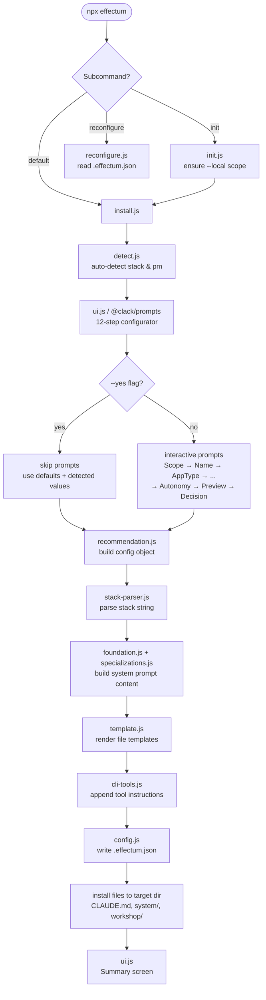

# Effectum — Architecture

> v0.4.0 · Autonomous development system for Claude Code

## Overview

Effectum is a Node.js CLI tool that installs and configures an autonomous development workflow for [Claude Code](https://github.com/anthropics/claude-code). It wraps Claude Code with spec-driven, TDD-first conventions, project-level configuration, and curated system prompts.

```
npx @aslomon/effectum              → install (global or local, default)
npx @aslomon/effectum init         → per-project initialisation
npx @aslomon/effectum reconfigure  → re-apply from existing .effectum.json
npx @aslomon/effectum --help       → usage help
npx @aslomon/effectum --version    → print version
```

---

## Top-Level Architecture

```
CLI Entry Point
  bin/effectum.js   (subcommand router)
        │
        ├── "init"         → bin/init.js         (per-project setup, delegates to install.js)
        ├── "reconfigure"  → bin/reconfigure.js   (re-apply saved config)
        └── (default)      → bin/install.js       (interactive configurator + file installer)
                                  │
                                  └── bin/lib/     (shared library modules)
```

`bin/effectum.js` parses `process.argv`, strips the subcommand token, and `require()`s the appropriate script. No subprocess spawning — all routing is in-process.

---

## Library Modules (`bin/lib/`)

| Module | Responsibility |
|---|---|
| `detect.js` | Auto-detects project name, tech stack (Next.js, Python/FastAPI, Swift/iOS), and package manager from lock files |
| `config.js` | Read/write `.effectum.json` (v0.4.0 schema); preserves `createdAt` on upgrades |
| `utils.js` | Shared helpers: `ensureDir`, `deepMerge`, `findRepoRoot` |
| `recommendation.js` | Generates a recommended configuration based on detected stack and user inputs |
| `foundation.js` | Builds the base system-prompt and CLAUDE.md content ("foundation layer") |
| `specializations.js` | Adds stack-specific instructions on top of the foundation (language/framework rules) |
| `app-types.js` | Defines known application types (web app, API, CLI, mobile, library, etc.) and their metadata |
| `languages.js` | Registry of supported programming languages and their toolchain conventions |
| `constants.js` | Shared constants: config filename, version strings, default values, step names |
| `template.js` | File-template rendering — fills placeholders in system prompt and CLAUDE.md templates |
| `stack-parser.js` | Parses detected or user-supplied stack strings into structured objects consumed by other modules |
| `ui.js` | Terminal UI helpers built on `@clack/prompts` — spinners, styled boxes, step headers |
| `cli-tools.js` | Detects installed CLI tools (e.g. `gh`, `vercel`, `supabase`) and generates tool-usage instructions |

---

## Data Flow



---

## Filesystem Layout

```
effectum/
├── package.json               Package manifest (name, version, bin entry, dependencies)
│
├── bin/                       All executable & library code
│   ├── effectum.js            ← CLI entry point / subcommand router
│   ├── install.js             ← Main installer & interactive configurator
│   ├── init.js                ← Per-project init (delegates to install.js)
│   ├── reconfigure.js         ← Re-apply from .effectum.json
│   └── lib/                   ← Shared library modules (see table above)
│       ├── detect.js
│       ├── config.js
│       ├── utils.js
│       ├── recommendation.js
│       ├── foundation.js
│       ├── specializations.js
│       ├── app-types.js
│       ├── languages.js
│       ├── constants.js
│       ├── template.js
│       ├── stack-parser.js
│       ├── ui.js
│       └── cli-tools.js
│
├── system/                    System prompt templates & base instructions
│   └── ...                    (copied into target project during install)
│
├── workshop/                  Starter workshop files / scaffolding templates
│   └── ...                    (copied into target project during install)
│
└── docs/                      Project documentation (you are here)
    ├── architecture.md
    ├── modules.md
    └── configurator-flow.md
```

**Target project** (after install):

```
<your-project>/
├── .effectum.json             Persisted configuration (version, scope, stack, autonomy, …)
├── CLAUDE.md                  Generated project instructions for Claude Code
├── system/                    Copied system prompt files
└── workshop/                  Copied workshop / scaffolding templates
```

---

## Key Design Decisions

- **Zero runtime dependencies** except `@clack/prompts` (terminal UI). No bundler required.
- **In-process routing** — subcommands are loaded via `require()`, not spawned as child processes.
- **Config-first** — `.effectum.json` is the single source of truth. `reconfigure` re-runs the install from it without re-prompting.
- **Non-destructive upgrades** — `config.js` preserves the original `createdAt` timestamp when updating an existing config.
- **Node ≥ 18** required (uses native `fs.mkdirSync` recursive, structured output, etc.).
