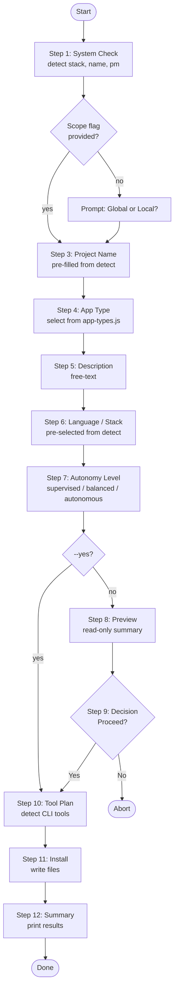

# Effectum — Configurator Flow

The configurator is the interactive heart of `install.js`. It guides the user through 12 sequential steps to collect all information needed to generate a tailored Claude Code setup.

---

## Invocation

```bash
# Full interactive flow
npx @aslomon/effectum

# Non-interactive — skip all prompts, use detected/default values
npx @aslomon/effectum --yes        # or -y

# Force scope
npx @aslomon/effectum --global     # or -g
npx @aslomon/effectum --local      # or -l
```

---

## The 12 Steps

### Step 1 — System Check

**What happens:**
- Verifies Node.js version meets the `>=18.0.0` requirement.
- Checks for the presence of Claude Code in the environment.
- Runs `detectAll()` from `detect.js` to gather:
  - Current directory name → default project name
  - Tech stack → pre-select stack option
  - Package manager → inform generated instructions
- Displays a welcome banner via `ui.js`.

**Non-interactive:** Runs automatically; no user input required. Failures abort early with a clear error message.

---

### Step 2 — Scope

**What happens:**
- Asks: **Global install** (applies to all projects, writes to `~/.claude/`) or **Local install** (project-specific, writes to `./`)?
- Default: local.

**CLI flags:** `--global` / `-g` or `--local` / `-l` skip this prompt entirely.

**Non-interactive (`--yes`):** Defaults to local scope.

---

### Step 3 — Project Name

**What happens:**
- Prompts for the project name.
- Pre-filled with the value detected by `detectProjectName()` (directory basename).
- Used in the generated `CLAUDE.md` header and `.effectum.json`.

**Non-interactive:** Uses the detected directory name as-is.

---

### Step 4 — App Type

**What happens:**
- Presents a selection list of known application types (from `app-types.js`):
  - Web App, Full-Stack App, API / Backend, CLI Tool, Mobile App, Library / Package, and others.
- The chosen app type influences which specialization rules are applied in `specializations.js`.

**Non-interactive:** Defaults to `web-app` (or the most likely type inferred from the detected stack).

---

### Step 5 — Description

**What happens:**
- Free-text prompt: *"Describe your project in one sentence."*
- Written verbatim into `CLAUDE.md` as the project description.
- Helps Claude Code understand the domain and purpose without reading the codebase.

**Non-interactive:** Left empty or set to a generic placeholder.

---

### Step 6 — Language / Stack

**What happens:**
- Presents a selection list of supported stacks / language combinations (from `languages.js` and `stack-parser.js`):
  - TypeScript · Next.js + Supabase
  - TypeScript · Next.js (standalone)
  - Python · FastAPI
  - Swift · iOS / SwiftUI
  - Other / custom (free-text fallback)
- Pre-selects the stack detected in Step 1.

**Non-interactive:** Uses the auto-detected stack; falls back to `nextjs-supabase` if nothing is detected.

---

### Step 7 — Autonomy Level

**What happens:**
- Asks how much Claude Code should do autonomously without pausing to confirm:

| Level | Behaviour |
|---|---|
| `supervised` | Claude pauses before destructive operations and large refactors |
| `balanced` | Claude proceeds confidently; pauses only for ambiguous architectural decisions |
| `autonomous` | Full autopilot — Claude completes entire tasks end-to-end with minimal interruption |

- The selected level is embedded in the system prompt to calibrate Claude's behaviour.

**Non-interactive:** Defaults to `balanced`.

---

### Step 8 — Preview

**What happens:**
- Displays a **read-only summary** of all choices made so far:
  - Scope, project name, app type, description, stack, autonomy level.
  - List of files that will be written (paths depend on scope).
- No input required — purely informational.
- Rendered by `ui.js` as a styled box.

**Non-interactive:** Skipped (no display).

---

### Step 9 — Decision

**What happens:**
- Final confirmation prompt: **"Proceed with installation?"** (Yes / No / Edit)
- `No` aborts cleanly with no files written.
- `Edit` (if supported) loops back to the relevant step.
- `Yes` proceeds to file generation.

**Non-interactive (`--yes`):** This step is skipped entirely; installation proceeds immediately after Step 8.

---

### Step 10 — Tool Plan

**What happens:**
- Runs `cli-tools.js` to detect installed CLI tools (`gh`, `vercel`, `supabase`, `pnpm`, `bun`, etc.).
- Builds tool-specific instruction blocks to append to the Claude Code system prompt.
- Shows a brief list of detected tools so the user knows what was found.

**Non-interactive:** Runs silently; results are included in generated files without display.

---

### Step 11 — Install

**What happens:**
- Assembles the full configuration object.
- Calls `writeConfig()` to persist `.effectum.json` in the target directory.
- Calls `template.js` / `foundation.js` / `specializations.js` to render `CLAUDE.md`.
- Copies `system/` and `workshop/` directories from the Effectum package into the target directory (using `ensureDir` + file copies from `utils.js`).
- A spinner (from `ui.js`) shows progress for each file written.

**File locations written (local scope):**

```
<project>/
├── .effectum.json
├── CLAUDE.md
├── system/      ← copied from effectum package
└── workshop/    ← copied from effectum package
```

**File locations written (global scope):**

```
~/.claude/
├── .effectum.json
├── CLAUDE.md
└── system/
```

---

### Step 12 — Summary

**What happens:**
- Displays the final success panel via `ui.js`:
  - ✅ List of all files written with their absolute paths.
  - Next-steps instructions (e.g. *"Open your project in Claude Code and start building."*).
  - Version and repository link.

**Non-interactive:** Summary is still printed so the user has a record of what was installed.

---

## Non-interactive Mode (`--yes` / `-y`)

When `--yes` is passed, the configurator skips all interactive prompts and substitutes defaults or auto-detected values:

| Step | Default used |
|---|---|
| System Check | Always runs |
| Scope | `local` (unless `--global` / `--local` explicitly passed) |
| Project Name | Detected directory basename |
| App Type | `web-app` |
| Description | *(empty)* |
| Language / Stack | Auto-detected; falls back to `nextjs-supabase` |
| Autonomy | `balanced` |
| Preview | Skipped |
| Decision | Auto-confirmed (yes) |
| Tool Plan | Runs silently |
| Install | Runs |
| Summary | Printed |

**Example — fully non-interactive local install:**

```bash
npx @aslomon/effectum --yes --local
```

**Example — CI/CD global install:**

```bash
npx @aslomon/effectum --yes --global
```

---

## Flow Diagram


