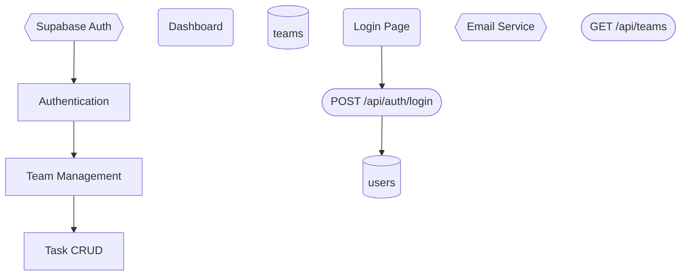
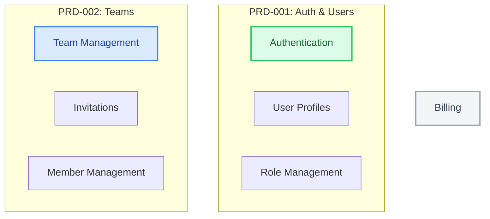
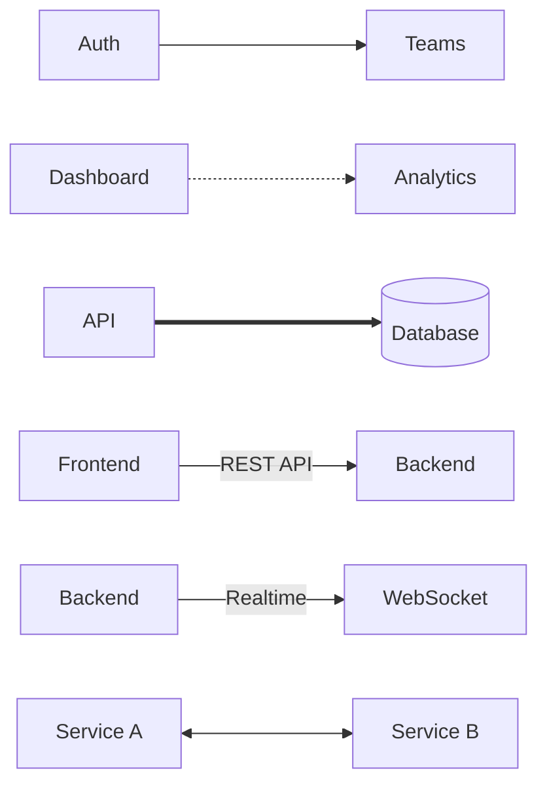
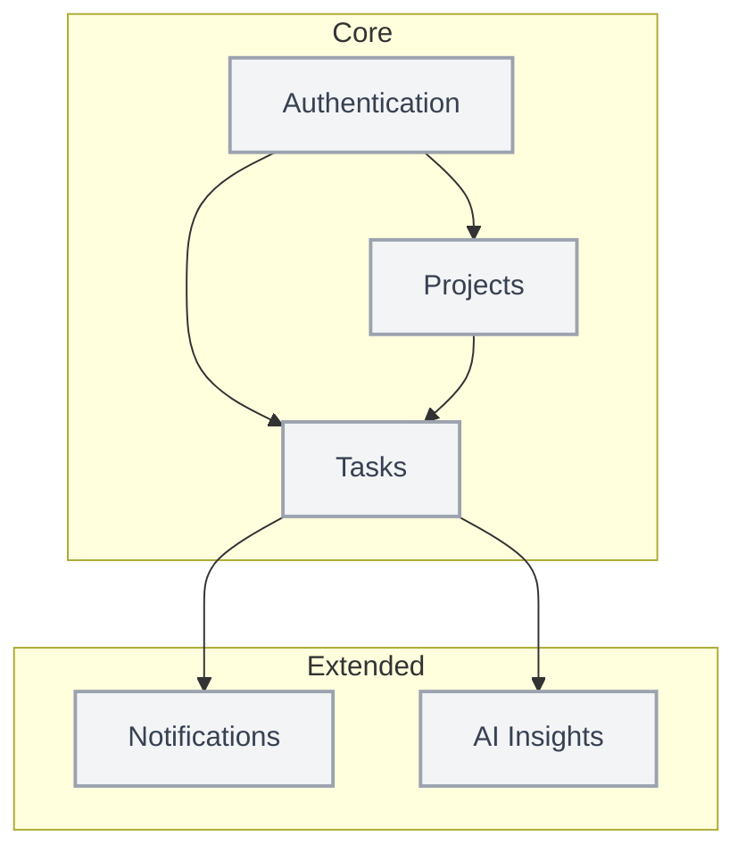
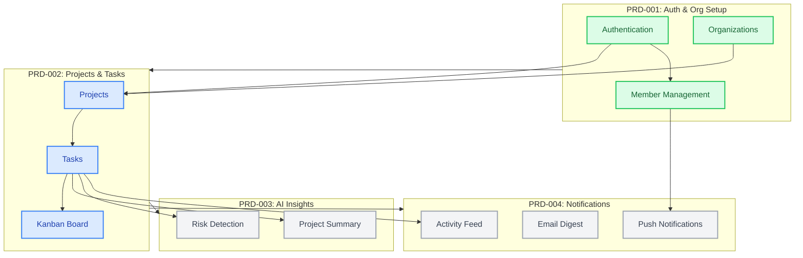
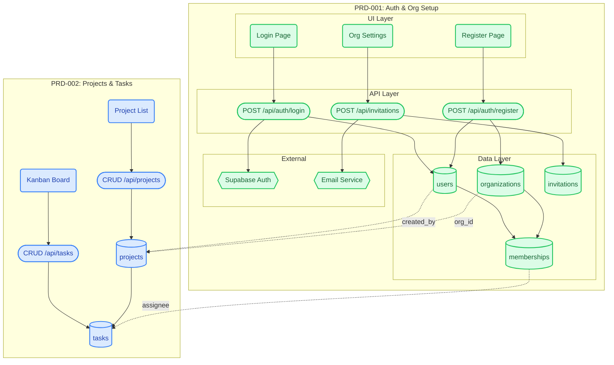
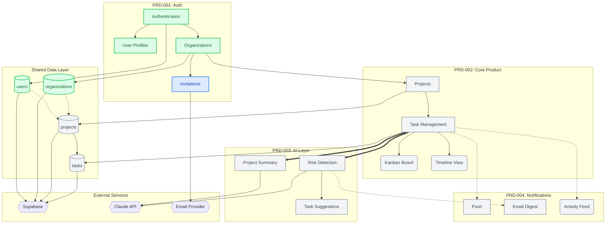

# Project Network Map Guide

The Project Network Map is a living Mermaid diagram that visualizes the entire project architecture: features, modules, data entities, connections, and dependencies. It grows with every PRD and every new insight.

---

## Purpose

The Network Map answers these questions at a glance:

1. **What exists?** — All features, modules, and data entities
2. **How does it connect?** — Dependencies, data flows, API calls, user journeys
3. **What belongs together?** — Bounded contexts, PRD boundaries
4. **What comes first?** — Build order based on dependencies
5. **Where is complexity?** — Nodes with many connections = high risk, plan carefully

---

## Mermaid Syntax Reference

### Basic Graph Structure



### Styling for Status and PRD Assignment



### Connection Types



---

## Map Evolution Stages

### Stage 1: After Scope Definition (Phase 2)

High-level feature overview. No technical details yet.



### Stage 2: After Decomposition (Phase 3)

PRD boundaries and dependencies visible.



### Stage 3: After PRD Details (Phase 5)

Full technical detail: data entities, API endpoints, UI components.



---

## Node Type Conventions

| Shape     | Mermaid Syntax | Represents               | Example                 |
| --------- | -------------- | ------------------------ | ----------------------- |
| Rectangle | `A[text]`      | Feature / Module         | `AUTH[Authentication]`  |
| Rounded   | `A(text)`      | UI Component / Page      | `LOGIN(Login Page)`     |
| Cylinder  | `A[(text)]`    | Database Table / Storage | `DB_USERS[(users)]`     |
| Hexagon   | `A{{text}}`    | External Service         | `SUPA{{Supabase Auth}}` |
| Stadium   | `A([text])`    | API Endpoint             | `API([POST /api/auth])` |
| Diamond   | `A{text}`      | Decision Point           | `CHECK{Has Account?}`   |
| Circle    | `A((text))`    | Event / Trigger          | `EVT((user.created))`   |

## Connection Type Conventions

| Style         | Mermaid Syntax    | Represents                              |
| ------------- | ----------------- | --------------------------------------- |
| Solid arrow   | `A --> B`         | Hard dependency (A must exist before B) |
| Dashed arrow  | `A -.-> B`        | Soft/optional dependency                |
| Thick arrow   | `A ==> B`         | Primary data flow                       |
| Labeled       | `A --\|label\| B` | Specific relationship type              |
| Bidirectional | `A <--> B`        | Two-way communication                   |

## Color Conventions

| Color           | Class        | Meaning                   |
| --------------- | ------------ | ------------------------- |
| Gray (#f3f4f6)  | `planned`    | Not yet started           |
| Blue (#dbeafe)  | `inProgress` | Currently being developed |
| Green (#dcfce7) | `done`       | Implemented and verified  |
| Yellow border   | —            | PRD-001 subgraph          |
| Indigo border   | —            | PRD-002 subgraph          |
| Pink border     | —            | PRD-003 subgraph          |

---

## Best Practices

1. **Start simple, grow complex** — Stage 1 maps have 5-10 nodes. Stage 3 maps have 30-50. Never start at Stage 3.
2. **Update after every PRD** — The map should always reflect the latest understanding.
3. **Use subgraphs for PRD boundaries** — Makes it instantly clear which PRD owns what.
4. **Cross-PRD connections are critical** — These are the integration points that need the most attention.
5. **Status colors = progress tracking** — Flip nodes from planned → inProgress → done as work progresses.
6. **Direction matters** — Use `TB` (top-bottom) for hierarchical views, `LR` (left-right) for flow/sequence views.
7. **Keep labels short** — Node labels should be 1-3 words. Use the PRD for details.
8. **Highlight complexity** — If a node has 5+ connections, it is a complexity hotspot. Call it out.

---

## Example: Complete Map for a SaaS MVP



This map shows at a glance:

- PRD-001 is mostly done (green), with Invitations still in progress (blue)
- PRD-002, 003, 004 are planned (gray)
- The Tasks node is a complexity hotspot (5+ connections)
- Claude API is only needed by PRD-003 (AI Layer)
- Build order: Auth → Core → AI + Notifications (parallel)

---

## Auto-Sync Behavior

The network map is automatically updated by several workflow commands. You rarely need to edit it manually.

### When Auto-Sync Happens

| Trigger                 | What Changes                                                       | Command                       |
| ----------------------- | ------------------------------------------------------------------ | ----------------------------- |
| PRD created             | New feature nodes added with `:::planned`, grouped in PRD subgraph | `/prd:new`                    |
| PRD updated             | New nodes added, removed nodes deleted, connections updated        | `/prd:update`                 |
| Implementation starts   | Feature node flips from `:::planned` to `:::inProgress`            | Ralph Loop                    |
| Implementation complete | Feature node flips from `:::inProgress` to `:::done`               | Ralph Loop                    |
| Validation requested    | No changes — reports issues found                                  | `/prd:network-map --validate` |

### Frontmatter-Driven Generation

When PRDs have YAML frontmatter (the default since v0.6), the network map is generated deterministically from frontmatter data:

1. **Nodes** come from `features[]` across all PRDs in the project.
2. **Edges** come from `connections[]` across all PRDs.
3. **Subgraph boundaries** come from PRD `id` groupings.
4. **Cross-PRD edges** come from `depends_on[]`.
5. **Status colors** come from feature `status` field.

This means: if you update the frontmatter, the map updates automatically on the next `/prd:network-map` or `/prd:update` run. You don't need to manually edit the `.mmd` file.

### Validation

Run `/prd:network-map {slug} --validate` to check for:

- **Circular dependencies** between features or PRDs
- **Isolated nodes** with no connections (possible missing relationships)
- **Orphaned references** in connections that point to non-existent features
- **Status mismatches** between frontmatter and task registry
- **Completeness** — all frontmatter features present in the map

---

## Mermaid Syntax Safety Rules (MANDATORY)

When generating any Mermaid diagram, ALWAYS follow these rules to prevent parser errors:

### 1. Quote Labels with Special Characters
Labels containing `/`, `&`, `<`, `>`, `(`, `)`, `#`, or `@` MUST be wrapped in double quotes:

```mermaid
%% WRONG — will cause parse error:
DOCS_HOME[/docs/getting-started]:::done

%% CORRECT:
DOCS_HOME["/docs/getting-started"]:::done
```

### 2. Node IDs: Alphanumeric + Underscore Only
Node IDs must contain only letters, numbers, and underscores. No dots, slashes, hyphens, or spaces:

```mermaid
%% WRONG:
docs-home[Label]
api.users[Label]

%% CORRECT:
DOCS_HOME[Label]
API_USERS[Label]
```

### 3. Edge Labels with Special Characters
Edge labels containing special characters must also be quoted:

```mermaid
%% WRONG:
A -->|POST /api/users| B

%% CORRECT:
A -->|"POST /api/users"| B
```

### 4. Subgraph Names
Subgraph names can contain spaces but avoid special characters:

```mermaid
%% CORRECT:
subgraph PRD-001 [PRD-001: Authentication System]
```

### 5. Validate Before Writing
Before writing any `.mmd` file, mentally check: would this parse on mermaid.live without errors? If unsure, quote all labels.

**Rule of thumb: When in doubt, quote it.**
